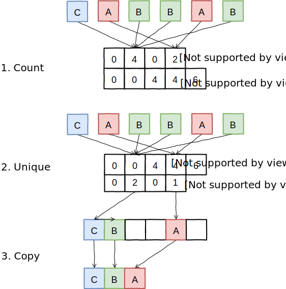
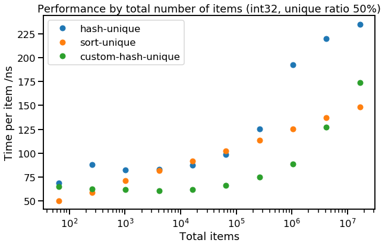
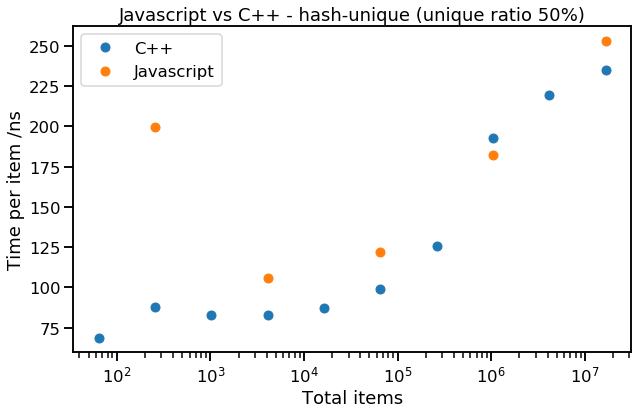
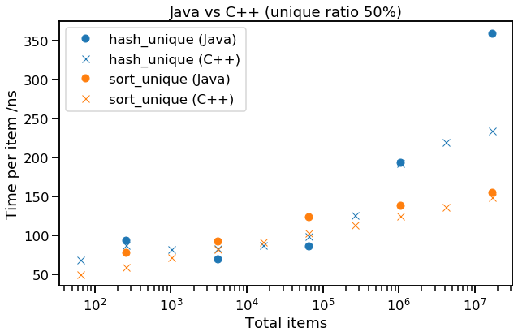

title: Hash vs Sort [2]
keywords: C++,Java,Javascript,unique,distinct,deduplication,hashset

# Hash vs sort \[part 2\]

[\[Part 1\]](../2019-09-hash-vs-sort/article.md), **\[Part 2\]**

In part 1, we saw two algorithms for finding unique items in a collection - _sort-unique_ and _hash-unique_. After benchmarking them in C++ we found that while _sort-unique_ was reasonably well-behaved (performing quite predictably), _hash-unique_ had a stepped curve (linked to the CPU cache hierarchy) and a surprisingly high cost per unique item (linked with allocation). We will noe extend our work of part 1 in two areas - trying to see if we can improve on _hash-unique_, and benchmarking the two original methods in _Java_ and _Javascript_, to check that our results don't only apply to C++.

## "Fixing" hash-unique

We haven't yet discussed why _hash-unique_ scales so badly with unique items. Our main suspects are memory locality and dynamic memory allocation (especially since _hash-unique_ is actually an incremental process, maintaining a set of unique items at all times, rather than only computing it when required). It is hard to do much about locality, since this is fundamental to the hashing solution. However since our task is to do a "one-off unique" (rather than an incremental "maintain-unique"), we might be able to "fix" the dynamic allocation problem.

Our idea is to count an upper bound on the number of items in each hash bucket, using a preparation pass where we count the total number of items that would be mapped to each hash bucket. This upper bound will only be reached if there are no duplicates, but means we can prepare enough space so we'll never need to reallocate memory. We then allocate contiguous chunks of memory for each hash bucket (e.g. a single array for the whole table, with stored indices in each hash bucket.) Note that this is a sort of [separate chaining](https://en.wikipedia.org/wiki/Hash_table#Separate_chaining), but can use an array rather than a linked list, since we know an upper bound on the size of each bucket.

In the second pass, we find unique items by hashing each item again, then doing an "insert if new" into the hash bucket backing array. Finally, we scan through the buckets, removing any space between buckets so that the unique items are contiguous (which can be done in-place).

The whole procedure looks something like this:



The implementation of this method (let's call it _custom-hash-unique_) is a bit more involved, if interested, see [code here](https://github.com/DouglasOrr/DouglasOrr.github.io/blob/examples/2019-09-hash-vs-sort/hashvssort.cpp). Let's see how it performs, looking at the trend of `int32` with 50% unique items:



This all looks quite good - _custom-hash-unique_ has a similar shape to _hash-unique_, but is considerably faster. Looks like allocations matter quite a lot! You might expect to see similar or better performance with a properly configured [open addressing](https://en.wikipedia.org/wiki/Hash_table#Open_addressing) hash set, which could also be preallocated to a sensible size, and would save the trouble of following a pointer (or offset) from the hash table itself to the backing array.

## Other languages

Returning to our two simple alternatives _sort-unique_ and _hash-unique_, let's benchmark two other popular languages - Javascript & Java to see if they show a similar pattern.

### Javascript

We implemented both _sort-unique_ and _hash-unique_ in Javascript, and benchmarked it as a standalone script using Node.js. The implementation of _hash-unique_ was very easy:

```javascript
let unique = new Set(items);
return Array.from(unique);
```

However, _sort-unique_ required our own adjacent-unique loop, as there is no equivalent of `std::unique` in Javascript's built-ins ([code here](https://github.com/DouglasOrr/DouglasOrr.github.io/blob/examples/2019-09-hash-vs-sort/hashvssort.js)). Here are the results (median runtime):

|$N$|$N_{unique}/N$|_sort-unique_|_hash-unique_|
|---|---|---|---|
|$2^{16}$|$\frac{1}{16}$|519 ns|<span class="result-positive">39 ns</span>|
|$2^{20}$|$\frac{1}{2}$|1284 ns|<span class="result-positive">182 ns</span>|
|$2^{24}$|$1$|1571 ns|<span class="result-positive">365 ns</span>|

These headline performance numbers show that _hash-unique_ is much (5-20x) faster than _sort-unique_; we suspect this is because we had to implement the second pass of _sort-unique_ (which removes adjacent duplicates) as a Javascript loop (there is no built-in method to speed it up). However, the performance of _hash-unique_ looks very good - let's compare it with C++:



Not too bad, Javascript, for a language that is meant to be slower than C++! Clearly the implementations of `new Set(items)` and `Array.from()` are reasonably efficient. This result suggests we should "run with the language" (i.e. lean heavily on the built-in data structures) where possible - particularly in very dynamic languages like Javascript. When we do this, even slower languages can match faster ones! Being able to use an optimised built-in routine rather than a scripted version can far outweigh any small algorithmic differences.

### Java

We tried the same again in Java. Again we're testing collections of integers, but in Java they can be "boxed" (held in an Object) e.g. `HashSet<Integer>`, or unboxed (held directly as a primitive value) e.g. `int[]`. We decided to use unboxed `int` values wherever possible, but in order to use `HashSet`, our implementation of _hash-unique_ boxed them temporarily. The results show good performance in general:

|$N$|$N_{unique}/N$|_sort-unique_|_hash-unique_|
|---|---|---|---|
|$2^{16}$|$\frac{1}{16}$|92 ns|<span class="result-positive">38 ns</span>|
|$2^{20}$|$\frac{1}{2}$|138 ns|194 ns|
|$2^{24}$|$1$|<span class="result-positive">157 ns</span>|369 ns|

This seems close enough to our original C++ results that it's worth comparing the trend:



Here we see Java performing about as well as C++, sometimes even better. However, the performance seems to follow the same trend, so what we learnt from C++ (_hash-unique_ is fastest for a data size that fit in L3, and low ratio of unique items, otherwise _sort-unique_) seems to apply to Java too.

## Conclusions

**Java's _hash-unique_ & _sort-unique_ behave similarly to C++**

Despite boxing integers & having a garbage collector in place of a manual allocator, Java implementations of these algorithms scale similarly and even have competitive runtime with their C++ versions.

**Javascript prefers the built-in _hash-unique_**

In dynamic languages, it is often more important to use built-in methods where possible than to achieve peak algorithmic efficiency, and this seems to be the case with Javascript. Even in cases where (if we were in C++/Java), _sort-unique_ should be faster, _hash-unique_ is faster in Javascript due to the efficiency of the library implementations of common data structures and algorithms.

**Using a specialised "one-off unique" (rather than "maintain unique") can speed up _hash-unique_**

Since we know all the items that are going to be added to the hash set in advance, we can construct an array with enough space allocated for every item in the original (and estimate an appropriate number of buckets). This means we never need to reallocate buckets or space for items (and items in a hash bucket can be contiguous in memory), which can give better performance.
