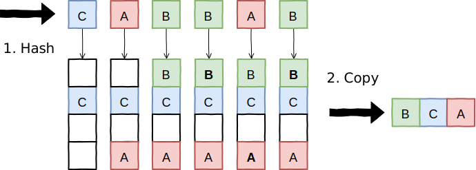
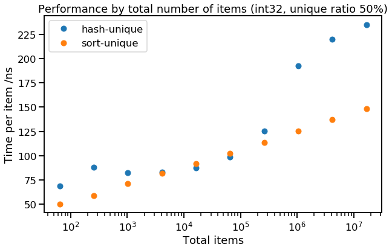
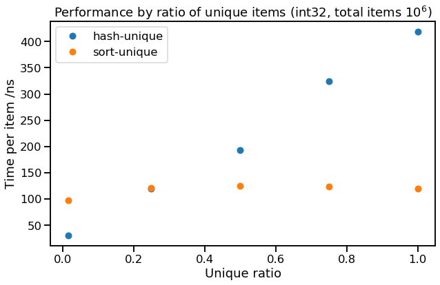

title: Hash vs Sort
keywords: C++,unique,distinct,deduplication,hashset
image: img/chart_total_items.png

# Finding unique items - hash vs sort?

**\[Part 1\]**, [\[Part 2\]](../2019-09-hash-vs-sort-2/article.md)

A while back, I was trying to speed up some code which finds unique items in a collection. For example, transforming `"AABBADCAB" => "ABDC"`. There are two ways to do this efficiently - one is based on sorting, the other based on hashing. So, _which is faster?_ I couldn't find the answer, so I ran some experiments and here are the results.

We'll start with C++, but we'll see if these results generalise to a couple of other popular languages in part 2. We'll begin by specifying the problem more precisely.

**The problem:** given an array of values, create a new array of all unique values from the original (in any order). This means that for each value in the original array there is exactly one value in the uniqued result that would compare equal. For example (in C++; we'll use a `std::vector` for the input and output type):

```c++
auto items = std::vector<int>{10, 20, 20, 30, 10, 10};
auto results = find_unique(items);
// => {10, 20, 30}
// (or {20, 10, 30}, etc.)
```

Although it's a very simple problem, I found the benchmarking results a bit surprising - investigating this has changed my mental model of what makes code fast or slow.

## How to find unique items - sorting

Both methods are based on the same idea: we need to collect identical items together in the same place, so we know where to look for the duplicates. One way to do this is to **sort** the items, after which any duplicates will now be adjacent, so we can make a second pass to scan through, removing adjacent duplicates. It looks a bit like this:


The first step is any standard sorting algorithm (e.g. [quicksort](https://en.wikipedia.org/wiki/Quicksort)). The second step is a linear scan which keeps track of the last item copied into the result as it scans through the array, and doesn't copy an item to the result if it compares equal to the last item. The C++ code to implement _sort-unique_ is simple (mainly because [`std::unique`](https://en.cppreference.com/w/cpp/algorithm/unique) already exists to implement step 2):

**sort-unique**

```c++
auto results = items;
std::sort(results.begin(), results.end());
auto n = std::unique(results.begin(), results.end()) - results.begin();
results.resize(n);
```

Since we're interested in the runtime performance of our code, we can use [Big O notation](https://en.wikipedia.org/wiki/Big_O_notation) to try give a very rough model of how runtime will scale with data size. In Big-O, _sort-unique_ takes $O(N)$ memory (although it can also be done in-place) and $O(N \log N)$ compute (e.g. if you count comparisons or data movement), due to the sort.

## How to find unique items - hashing

Another way to collect identical items together is to **hash** them, so we only have to check items that collide hash buckets to confirm that an item is new. This looks like:



In C++, you can implement _hash-unique_ by copying the collection into a [`std::unordered_set`](https://en.cppreference.com/w/cpp/container/unordered_set) and back out again:

**hash-unique**

```c++
std::unordered_set<T> set(items.begin(), items.end());
std::vector<T> results(set.begin(), set.end());
```

Again in Big-O, _hash-unique_ takes $O(N)$ memory and $O(N)$ compute (counting `std::hash` calls, or bucket accesses). So it looks like hashing is going to be our winner - _let's see it's actually faster..._

## Benchmarks

It isn't immediately obvious whether _sort-unique_ or _hash-unique_ would be faster for our performance-critical code. Our simple analysis (based on the number of copies, `operator<` or `std::hash` calls) said _sort-unqiue_ was $O(N \log N)$ and _hash-unique_ was $O(N)$, but you can't beat actually trying it out. Therefore let's try benchmarking these methods over some example inputs. We'll test things out using C++ to unique vectors of randomly sampled integers with the following variants:

- Total number of items: {$2^6$ .. $2^{24}$}
- Proportion of items that are unique: {$\frac{1}{16}$, $\frac{1}{4}$, $\frac{1}{2}$, $\frac{3}{4}$, $1$}
- Data size: {1, 2, 4, 8} bytes

Although it's unlikely any of these configurations will match any of our real problems, they should help show the trade-offs between the two approaches. Our performance results are all the median latency over 60 runs on an Ubuntu laptop <sup>[[Appendix 1]](#appendix-benchmarking)</sup>. We also separately instrument the objects in the collection to count data-oriented operations (construct, copy, assign) and logical operations (`operator<`, `operator==`, `std::hash`).

Here's a typical result: 1 million items, 50% unique, using `int32`:

| method        | time per item | data ops per item | logic ops per item |
| ------------- | ------------- | ----------------- | ------------------ |
| _sort-unique_ | 125 ns        | 17.9              | 24.7               |
| _hash-unique_ | 193 ns        | 1.00              | 1.50               |

In this instance, _sort-unique_ is slightly faster than _hash-unique_, even though _sort-unique_ is doing many more data operations (mainly move & move-assign), and logical operations (less). Clearly the bottleneck here for _hash-unique_ isn't the object's operations - probably memory allocation and locality of access should be our top suspects for this hidden cost, but more on that later.

Things become more interesting when we look at trends:



Here we can see how performance degrades as we scale the total number of items being uniqued, while keeping the data type fixed (`int32`) and the proportion of unique items fixed (50%). We can see that _sort-unique_ is faithfully obeying $O(N \log N)$ for execution time - this means that the time per item is $O(\log N)$, or a straight line on the graph above (as the x-axis is logarithmic). The runtime of _hash-unique_ is a bit more interesting - there the runtime gets much worse approaching 1 million total items (each of which is 4 bytes), which is suspiciously close to my test machine's 4 MB of L3 cache.

We can also look at how the proportion of unique items affects performance:



Here we see how strongly _hash-unique_ depends on the ratio of unique to total items (unique ratio = $N_{unique}/N$), whereas _sort-unique_ doesn't seem to care. This is because the size of the hash set that _hash-unique_ maintains scales with the number of unique items, not the total number of items, whereas the first pass of _sort-unique_, which dominates the workload, does not gain an advantage from duplicate items.

Finally, we didn't find that data size made much difference to performance. Small data types (e.g. `uint16`) were slightly faster for _hash-unique_, but the difference was marginal.

### Analysis

Altogether, the runtime of _sort-unique_ followed the trend we expected, $O(N \log N)$, and was independent of the ratio of unique items. _Hash-unique_, however, takes more time for each unique item, and the runtime jumps when the hash table begins to spill out of L3 cache to main memory (our expected trend of $O(N)$ was a very poor fit to the data).

To check these observations, we tried to fit a linear predictive model to the runtime, with the features $\left[1, N, N \log(N), N_{unique}, N_{unique} \log(N_{unique})\right]$. Pruning small contributions, this gave:

$$
\begin{align}
t_{\textit{sort-unique}} &= 8 N \log(N) \\\\
t_{\textit{hash-unique}} &= 27 N_{unique} \log(N_{unique}) + 3 N \log(N)\,,
\end{align}
$$

which fits our observation that _hash-unique_ has a high cost per unique item, while _sort-unique_ has a moderate cost per item (whether unique or duplicate), and that even _hash-unique_ fails in practice to scale better than $O(N \log N)$.

These results suggest the following extreme examples that favour hashing & sorting (with our original moderate example also repeated), again reporting the time per item in nanoseconds:

| $N$      | $N_{unique}/N$ | _sort-unique_                               | _hash-unique_                              |
| -------- | -------------- | ------------------------------------------- | ------------------------------------------ |
| $2^{16}$ | $\frac{1}{16}$ | 75 ns                                       | <span class="result-positive">21 ns</span> |
| $2^{20}$ | $\frac{1}{2}$  | 125 ns                                      | 193 ns                                     |
| $2^{24}$ | $1$            | <span class="result-positive">143 ns</span> | 517 ns                                     |

## Conclusions

Our results lead us to two high-level conclusions:

**Use sort-unique when `data size > L3`, or when the proportion of unique items is high**

_Hash-unique_ suffers from very cache-unfriendly data access pattern, so gets much slower when the dataset falls out of CPU cache. Also, much of the cost of _hash-unique_ seems to be allocation-related, so performance is worse when the proportion of unqiue items is high. In these cases, the more steady scaling of _sort-unique_ makes it a better choice.

**Computational complexity by counting logical ops can be a bad predictor of performance**

We saw that _sort-unique_ scales faithfully as $O(N \log N)$, both in terms of number of logical / data operations and in runtime. _Hash-unique_ also scales faithfully in number of logical / data operations, $O(N)$, but scales $O(N \log N)$ in runtime.

This is because our complexity analysis ignored the effect of cache hierarchies on performance (it effectively employed a "flat cost" model for any random access to memory). This proved very unrealistic for _hash-unique_ (even though the same model was OK for _sort-unique_). We don't propose a better model here, but it's a reminder to keep an eye on [locality of reference](https://en.wikipedia.org/wiki/Locality_of_reference) when thinking about performance.

_Read on... [\[Part 2\]](../2019-09-hash-vs-sort-2/article.md)_

---

## Appendix - benchmarking

_Note: this includes the setup for Part 2, which includes other programming languages._

- Code: [C++](https://github.com/DouglasOrr/DouglasOrr.github.io/blob/examples/2019-09-hash-vs-sort/hashvssort.cpp), [Javascript](https://github.com/DouglasOrr/DouglasOrr.github.io/blob/examples/2019-09-hash-vs-sort/hashvssort.js), [Java](https://github.com/DouglasOrr/DouglasOrr.github.io/blob/examples/2019-09-hash-vs-sort/HashVsSort.java)
- Results: (in `.csv.gz` format), [C++](https://github.com/DouglasOrr/DouglasOrr.github.io/raw/data/2019-09-hash-vs-sort/timings_cpp.csv.gz), [Javascript](https://github.com/DouglasOrr/DouglasOrr.github.io/raw/data/2019-09-hash-vs-sort/timings_js.csv.gz), [Java](https://github.com/DouglasOrr/DouglasOrr.github.io/raw/data/2019-09-hash-vs-sort/timings_java.csv.gz); see also the [analysis notebook](https://github.com/DouglasOrr/DouglasOrr.github.io/blob/data/2019-09-hash-vs-sort/Analysis.ipynb)
- Data: uniform random integers over domain, uniformly resampled to create duplicates
- Stats: run 30 or 60 times, report median

**Environment:**

```
CPU: i7-4510U, 2.00GHz, 2 cores, 4 MB cache
Memory: 8 GB DDR3, 1600 MT/s
OS: Ubuntu 18.04 (64 bit), in Docker
C++: gcc version 7.4.0  [flags: -O2 -std=c++17]
Javascript: Node.js v10.16.3
Java: OpenJDK 11.0.4
```
