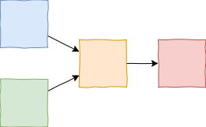

title: Design data for machines. [2]
keywords: development,programming,software,data

# Design data for machines.

[\[Part 1\]](../2020-03-data-for-machines/article.md), **\[Part 2\]**

This is the second part of our series _Write code for humans, design data for machines_. In [part 1](../2020-03-data-for-machines/article.md) we saw why it's better to write code for humans to read. Now in part 2, we'll see why it's better to design data for machines to read.


## Design data for machines

When I design the output data generated by my program, my main aim is that the generated data is readable unambiguously & efficiently by another program. (Although I might also need output for a human to read.)

An example. I've created a unit test framework, which automates execution of small test cases over different parts of my code. It finds tests that I've written, runs them and collects results. Here is an initial design for the final output of this program:

```
Success 😃!
    64 tests passed, 2 ignored, 0 failed

Test coverage: 96%
    base.bar: 88%
    base.foo: 32%
    utility: 99%

Test duration 2.7s

Report generated on 23rd Feb '20
```

This is a reasonable & easy-to-read format for a human, but the task of writing another program to process the output sounds like a right old pain!

When I go with this design, everything's OK while I'm just running the tests myself & scanning the results. But one day I start running the tests in continuous integration, and I stop looking at the output. Soon after, I want to write another program to track the trend of test coverage over time. Now the test output data has no human audience, but multiple machines consuming the output downstream (and eventually preparing a human-readable summary).

Let's have another go. I redesign my output with a focus on machine-readability, so the test execution program generates (reformatted & abbreviated here, with due irony, for ease of reading):

```json
{"success": true,
 "passed": ["base.bar.test_fidget", "base.bar.test_cricket", ...],
 "ignored": ["base.foo.test_flaky", ...],
 "failed": [],
 "coverage": {"base.bar": {"covered": 44, "total": 50}, ...},
 "duration": 2.71828,
 "generated": "2020-02-23T15:28:51Z"}
```

Using this output, it would be easy to recreate the original report for a "direct" human interface, but equally easy to parse for another purpose - to track coverage over time or aggregate into a super-report containing other build & test data, etc. This is what "designing data for machines" looks like.

We won't go into how to design data formats for machines, but in this case the main differences are that it contains full information that was summarised for the human and is in standard portable formats (JSON, ISO 8601). Note: we could have gone further - it is still a text-based container format that can be read by humans, rather than a binary format (e.g. Avro or Protocol Buffers).

So, one simple test to apply when designing data formats for machines is:

> How would I feel if I had to write a parser for these data?


## Why design data for machines?

Why should I design data for machines to read? Because, unlike source code, it is written by machines. And, this side of Artificial General Intelligence (dear reader on the other side, please disregard), machine-written text is just not as interesting as human-written text (or any other media!)

Here's a typical conversation with a machine these days...


Even with emoji, machine-generated canned text is a bit dull. Next week/month/year, I will get tired of looking at my program's output and will automate it. Now, invisible data is being transferred between two machines with no human looking at it, and the the system will be more likely to work if the data is designed for machines to read simply and unambiguously.

But, you might reasonably argue: "ultimately, the data our programs generate will be shown to human readers - doesn't that kill the argument?" I'd say no - although some information will eventually be shown to a human, we tend to assume it's the program we're writing right now that will do it and we're often wrong. There are usually a few more machines in the chain before it finally appears in front of a human. So I'm not advocating for a hard push to an extreme position "all output must be easily machine-readable" - more of a gentle nudge away from our default, which is to design too much data for humans.

> "Our default is to design too much data for humans"

We know (too late) when this has gone wrong when machines are writing and reading data in formats that were designed for humans, but are never being read by humans. Clearly this is a silly outcome - but it is surprisingly easy to get there.

The cost of this is usually borne by the reading code - it might have slow and brittle regular expressions to parse input, and need to make assumptions about how to interpret the input. The latter is a particularly worrying problem for machines. In our test example, a machine reading `"23rd Feb '20"` might have to assume it was assume 21st century, so the year `2020`. A machine that reads `"2020-02-23T15:28:51Z"`, however, has no such problem. Parsing ambiguous input is hard, and we should avoid it when we can!


## Functions too

This problem isn't limited to complete programs, the same logic applies to individual functions, for example:

```python
import os

def move(src, dest):
    """Rename a file or directory src -> dest."""
    try:
        os.rename(src, dest)
    except OSError as e:
        print(f'Error! could not move {src} to {dest}: {e}')
        exit(1)
```

This function may be fine in a small single-purpose script, but in a larger program it is a recipe for pain. It assumes that it owns the user interaction, so is uniquely able to tell the user about their error (although in generic terms). The error message is reported over stdout, which in Unix is a bad idea - what if stdout is being piped into another program? Finally, there is no chance for the caller to handle the error (without abusing Python's dynamism) as the function calls `exit()` directly. The output is designed for humans at the expense of machines (so, at the expense of composability).

_Note: there isn't a need for a "better version" of this function, as all it does is wrap `os.rename` to make it worse!_


## What should I do?

Unlike source code, it is hard to make program output easy for both humans and machines to read, which is unfortunate. Back in Part 1, we didn't really have to sacrifice any machine-readability when we went from `get_results` to `nlargest_unique`, but we did have sacrifice human-readability when we went from `Success 😃` to `{"success": true}`.

> Designing data formats for machines to read has an obvious drawback - it will be harder for the human to read.

There are a few ways to "have our cake and eat it" here. One is to create two modes of running our program - one that generates a machine-readable output, another that generates human-readable output. We could also create both outputs at the same time - maybe the program generates human-readable info at the command line, but also a machine-readable data file. Or we could build a separate special post-processor or wrapper program that translates machine output into human output - typically this is a relatively simple program that just reformats and presents the data.

When thinking about code, our advice was "consider your primary audience humans", so our advice now for data design is "usually, consider your primary audience machines". Clearly an interactive UI should be designed for humans, but usually, most parts of your program will be operated by machines, and their output read by machines - so consider what is easiest for the machine to read. Machines are very different to humans - when I say "easy" for a machine to read, I really mean _efficient_, _unambiguous_ and often _portable_. For serialised data, standard container formats like JSON, Avro, protocol buffers, XML, etc are a great place to start.


## Conclusion: humans write for humans; machines write for machines

This is a complex and nuanced topic that I could keep writing about, but I sense my human audience has dwindled and only the machines that trawl the web have made it this far... So in summary, **the code humans write should be written with a human reader in mind; and the data machines write should be designed with a machine reader in mind**.

Writing code for human readers will make our software less bug-ridden and more easily modifiable over time. Designing data for machine readers will make our software more composable, more efficient and yes, less bug-ridden.

`^D`


<hr class="appendix-separator">

**Appendix - why do we design data for humans too often?**

I think our problem comes from the _order_ in which we often construct our systems (multiple communicating programs). Imagine I'm building a system that will ultimately consist of four programs (or components) like this:



I'll almost certainly start by designing and coding up the blue or green (leftmost) boxes, since they can be completed & tested without having to build any other boxes. Then I'll move on to the orange box (I might not even have thought of the red (rightmost) box at this stage). I'll eventually build up from the low-level components through to the highest-level ones, and hey presto, a working solution!

The problem is that when I construct my systems in a bottom-up fashion, at first a human (me) is the only consumer of low-level outputs (there is no machine that can read their output yet), so I design the output for myself, not for another machine to easily read. This doesn't seem like a huge problem - as long as I am not too committed to the low-level program's interfaces, I can go back and change them. But there are enough examples around of popular programs that do not have good machine interfaces to dismiss this as a minor & temporary setback.

---

_Robot Icon credit: 094-robot-face-3.svg Twitter/@webalys, Streamline Icons via Wikipedia Commons._
