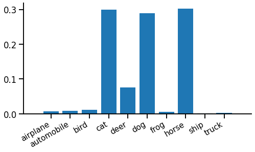
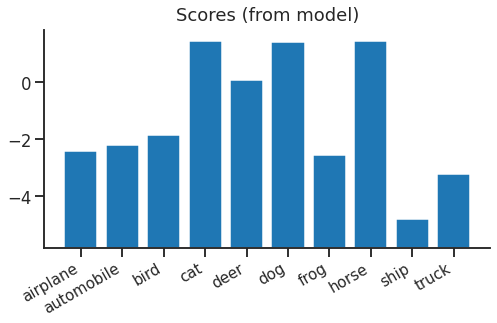
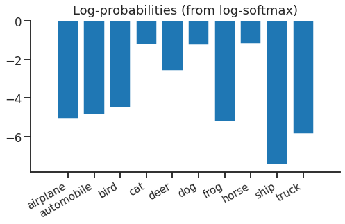
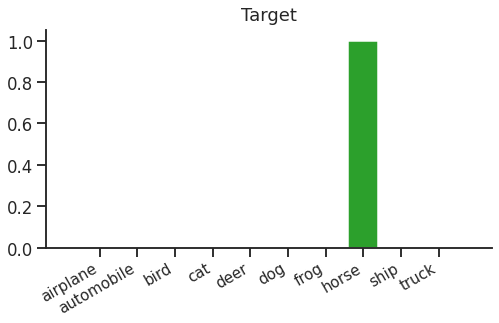
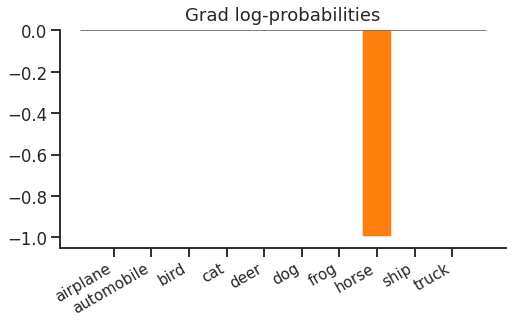

title: Softmax Cross Entropy Loss
keywords: deep-learning,training,tutorial

# Softmax Cross Entropy Loss

If you’ve tried deep learning for yourself, I’d bet you’ve trained a model using some variant of softmax cross entropy loss. It’s so overwhelmingly popular I thought I might write a series of blog posts ([index](/index.html#classifier-training-objectives)) to remind myself there are other options out there!

So why not skip straight to the other juicy options? First, we should probably compare the weird 1% alternatives to the dominant 99% market leader. But second, it turns out that softmax cross entropy loss is actually quite interesting...

In this article, we'll think through the core idea of softmax cross entropy loss, see how to add it to a PyTorch model, and finally look at what actually happens when we use this loss. Note: I'm assuming you already know some core deep learning concepts - e.g. what a forward pass, backward pass and loss function is.


## Core idea

Imagine we’re trying to train a function to classify images is it a plane / bird / horse etc. For example, here’s an input image:


Our function should predict that this is a horse. However this objective isn’t very "continuous" - we’re either right (if we said "horse") or wrong (e.g. if we said "dog"). It’s hard to optimize such a hard "right or wrong" outcome, so we "relax" our outputs & say our function is going to predict a probability distribution over all the possible labels for the image.

> "Relax" in this context essentially means: "hey there, function, chill on this "horse" business a bit - it might be a large dog, after all".

So the output might look a bit like this:



The height of each spike is the probability of that label. Here, the model is pretty confident it's either a cat, dog or horse, but not very sure which.

Now we have two problems left. First, we need our function to produce something that obeys the rules of a probability distribution. Each output must be positive, and all outputs must sum to 1. One easy way to do this is the _softmax_ function. Softmax applies each rule in turn to "brute force" any input into a probability distribution output. First to make each output positive, we exponentiate, $z\\!=\\!e^x$. Then to make sure the outputs sum to one, we divide by their sum, $y=z\,/\\!\sum\\! z$. Putting this together we have the softmax function:

$$y_i = \frac{e^{x_i}} {\sum_j e^{x_j}}$$

The second problem is to define a _loss function_ that compares our function’s probability output against a target label and tries to make them as similar as possible. Imagine that the true labels are actually single samples from a true probability distribution, which says "given this bunch of pixels, it’s a horse 90% of the time, a dog 6% of the time, etc…".  In this case, a reasonable way to compare two probability distributions (one of which is known, the other only provides samples) is cross entropy. The cross entropy between our function and reality will be minimized when the probabilities exactly match (in which case cross entropy will equal reality’s own entropy.)

Putting this together, we apply softmax then take cross entropy against a single target sample $t$ - this is the "softmax cross entropy" loss function:

\begin{equation}
L(x, t) = -x_t + \log \sum_i \\!e^{x_i}
\label{eqn:loss}
\end{equation}

Fortunately, using this loss function is a bit easier than motivating it...

## PyTorch implementation

Adding a softmax cross entropy loss at the end of a PyTorch model is very easy. So common that they don’t even want you to have to type "softmax"...

```python
labels = ...
outputs = ...

loss = T.nn.functional.cross_entropy(outputs, labels)
print(float(loss))
loss.backward()
```

The model produces `outputs`, which are typically shaped `(batch x num_classes)`, and the function `T.nn.functional.cross_entropy` (or alternatively the module `T.nn.CrossEntropyLoss`) implements the softmax + cross entropy equation \eqref{eqn:loss}.

## What does it do?

In the forward pass, we start with a vector of floats from our model. We can think of these as "scores" for each class:



Because of the next step, the absolute values of the scores don't mean anything, and there's nothing "special" about zero.

Looking at equation \eqref{eqn:loss} above, we see that softmax + cross entropy is actually the same as log(softmax) + lookup + negation. It turns out this is an easier way to follow through the logic. First we apply log-softmax to our scores, turning them into log probabilities. This means if you exponentiate & sum them, you’ll get 1. These log probabilities look like this:



Log softmax hasn’t done anything very complex - it has just shifted everything down by the same amount so that if you exponentiate & sum, you’ll get 1.

The final step in the forward pass is lookup & negation. We just need to look up the log-probability of the true label ("horse"), negate it, and we have our cross entropy loss for this example. We can think of the lookup as a dot product with a "one hot" target distribution that looks like this:



Dot-product this target vector with our log-probabilities and we get the softmax cross entropy loss (in this case, `1.194`).

### The backward pass

Now we can get to the "main business". The point of the loss is really to provide gradients to update the parameters in our model. So let’s walk back through the gradients.

The first step is to get gradients with respect to log-probabilities. This is easy - from the lookup (or dot product) and negation, we get:



Just a (flipped) one-hot vector again. The cross entropy loss only cares about the probability of the correct label "horse", nothing else. You could increase the probability of "dog", and as long as you "fix" the probability distribution without changing the probability of "horse", there would be no change in the loss.

Next, we backpropagate through the log-softmax to find the gradient with respect to scores:


Now, this says that if you increased the score of "dog", the loss would increase. This is because of the softmax normalization term - if you increased the "dog" score, all other log-probabilities would decrease by the same amount, which means the "horse" log-probability would decrease (and the loss increases).

If we check the gradient equation, we notice a couple of interesting things:

$$\frac{dL}{dx_i} = p_i - \delta_{it}$$

Here, $p_i$ is the (softmax-ed) predicted probability of class $i$ ($p_i = \mathrm{softmax}(x)\_i$), and $\delta_{it}$ is the Kronecker Delta (1 when the indices are equal, otherwise 0). The first thing to notice is that only the correct class $t$ has a negative gradient, all the other classes have a positive gradient. This means that softmax tries to "push up" the score of the correct class, and "push down" all other scores. High-probability incorrect classes are pushed down more than low-probability ones, which makes sense.

The second thing to notice is that the gradient must sum to zero ($\sum_i p_i =\\! 1$ and $\sum_i \delta_{it} = 1$). This means that the gradient below the axis for the correct class is "balanced" by the same total gradient (spread across all other classes) above the axis.

Finally, the magnitude of the gradient depends on the probability of the target class, as the total probability above and below the axis is $1-p_t$. This makes intuitive sense - if the probability of the target class is already 1, the loss is already minimized, so no update is needed. But if the probability of the correct class is small, the model should get a large update.

These observations can motivate two variations on softmax cross entropy - one tries to provide "positive" updates to more classes with a richer target distribution ([teacher-student training](../2-teacher/article.html)). Another tries to optimize the computation by using sparse "negative" updates to incorrect classes ([sampled softmax](../3-sampled/article.html)).

## Wrap up

We’ve seen softmax cross entropy, it’s motivation as a reasonably obvious way to relax and train a classifier and most importantly the gradient updates it feeds back to the classifier we’re training. It’s hard to beat it as a general purpose objective, so in the rest of the series, we’ll look at a few variations that’ll make sense in specific situations. For now, though, softmax cross entropy enjoys market dominance and that looks to continue for years to come.

<ul class="nav nav-pills">
  <li class="nav-item">
    <a class="nav-link" href="../2-teacher/article.html">Next - teacher-student training</a>
  </li>
  <li class="nav-item">
    <a class="nav-link" href="/index.html#classifier-training-objectives">Up - index</a>
  </li>
</ul>

## References

 - Softmax: [Multi-Category Classification by Soft-Max Combination of Binary Classifiers](http://www.gatsby.ucl.ac.uk/~chuwei/paper/smc.pdf), _Duan K, Keerthi SS, Chu W, Shevade SK, Poo AN._
 - CIFAR-10: [Learning multiple layers of features from tiny images](https://www.cs.toronto.edu/~kriz/learning-features-2009-TR.pdf), _Krizhevsky A, Hinton G._
