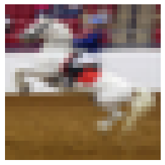

title: Value Function Estimation
keywords: deep-learning,training,tutorial

# Value Function Estimation

Value function estimation is a key component of many Reinforcement Learning (RL) algorithms. It provides a way to optimize indirectly, _without being told the right answer during training._

This is part of our series on [training objectives](/index.html#classifier-training-objectives), where we're looking at various objectives to use to train a (deep learning) classifier. Having looked at minor variations on the overwhelmingly popular softmax cross entropy, this is our first major departure. Now we'll try something considerably harder - to train our classifier without being told the right answer explicitly.


## The new game

Before we look at value function estimation, we need to understand that this isn't solving the same problem as softmax cross entropy. We can think of our models & training algorithm as trying to "play a game" and do as well as possible given the rules.

The "old game" is **supervised learning for classification**. Allowing ourselves to be over-specific... Your goal is to predict the correct label "airplane" or "automobile" or "bird", etc. for each image in a test. Your score is the percentage of images correctly labelled, given some hidden "ideal labelling". To prepare for the test, you're given a large set of images, alongside their ideal labels - which you can do whatever you want with.

```
# Supervised learning
  Find:        predict(x) -> y
  To maximize: sum [ metric(predict(x), y) ] over {(x, y)}_test
  Given:       {(x, y)}_train
```

The "new game" is **multi-armed contextual bandit learning**. This changes a couple of things. Instead of being told the ideal labels for some "training" images, you have to make a prediction & you're told if you're right or wrong. There is also no separate test phase - training & test are a single phase, and you're graded as you learn.

```
# Multi-armed contextual bandit learning
  Find:        predict(x) -> a
  To maximize: sum [ reward(predict(x)) ]
  Given:       reward(a) after each step
```

## Core idea

Value function estimation is a technique designed for bandit problems (and their even harder cousin, reinforcement learning). But in this article, we'll apply it back to our standard supervised learning problem we've used so far in our series. This means we can focus on the different type of loss without having to worry about other aspects of the harder problems like bandits / RL.

The core problem we need to solve is to create a _reward-based loss_ rather than a _target-based loss_. A reward-based loss is given feedback for the chosen prediction "was I right or wrong?", while a target-based loss is given the correct answer "was it a horse, cat, bird, etc?" From this, it's easy to see that the reward-based loss is a harder problem - you're given less information to help you learn.

For example, you're shown this image:



Your prediction for this image is "dog". A target-based loss is told:

> "It's a horse."

A reward-based loss is told:

> "No, it's not a dog."

This looks a bit harder - now we need to keep guessing until we get it right!

### Value functions

The idea of value function estimation is to predict how much reward you expect to get for each action you could take. This essentially turns it into a supervised learning problem, but where you learn rewards rather than label distributions.


## PyTorch implementation

## What does it do?
### The backward pass

## Wrap up

## References

