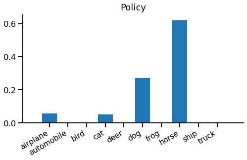

title: Policy Gradient Estimation
keywords: deep-learning,training,tutorial

# Policy Gradient Estimation

Policy gradient estimation is a popular technique for Reinforcement Learning (RL). It can optimize models to take good actions, even when the feedback provided for these actions is non-differentiable and includes randomness.

This is part of our series on [training objectives](/index.html#classifier-training-objectives), where we're looking at various objectives to use to train a (deep learning) classifier. In the last segment, we saw [value function estimation](../4-value/article.md), which can address similar problems to policy gradient estimation.

Of all the algorithms we have visited in this series, I find this one the most "magical". I initially found it surprising that it works at all. And thinking through it has helped me understand loss function design a bit more deeply. I hope it can pique your curiosity too!


## Core idea

We'll think through policy gradient being used to guess the correct label for an image. For example, given the image:


The network should guess "horse".

_Note that this is an unusual application of policy gradients - you'd usually just use something simple like softmax cross entropy here._

Like [we saw with value functions](../4-value/article.html#the-new-game), policy gradients are not "playing the same game" as softmax cross entropy. Instead of being told the right answer during training, we have to make a guess and are given a reward only if we guessed correctly. Please refer back to the value functions article for an introducion to the problem. But to recap, here's a glossary of terms:

 - _action_ - after being shown an image, we must choose a single action (e.g. guess "horse" or "frog")
 - _reward_ - we're given a reward for taking each action, either 1 or 0; our objective is to maximize this reward
 - _policy_ - defines our method of choosing an action based on an input; this replaces the predictor from supervised learning
 - _expectation_ - an average value, computed based on samples coming from a distribution
 - _network_ - a differentiable function that can be trained by backpropagation

So we want to choose actions to maximize expected reward. One big problem is that we can't directly compute the gradient of the reward with respect to the actions predicted by our network. This is critical, since we need these gradients to get backpropagation started.

> We want to choose actions to maximize expected reward.

Value functions sneakily side-step the problem of a non-differentiable reward by choosing a different task to solve. Instead of trying to directly maximize the reward with our actions, we just try to predict what the reward will be from a given action. Then we can separately define a policy that uses these predictions to maximize reward.

### Policy gradient estimation

Policy gradient estimation addresses the problem of a non-differentiable reward head-on. It means we can get a gradient for our policy to maximize the reward from an unknown, non-differentiable reward function.

It starts with a stochastic policy. A stochastic policy chooses actions randomly, but with different probabilities for each action. These probabilities are tuned during training to improve the expected reward. We denote sampling from our policy thus:

\begin{equation\*}
\tilde{a} \sim \pi(a|x,\theta)
\end{equation\*}

The policy $\pi$ defines a distribution of actions $a$ given an input $x$ and parameters $\theta$. We can sample actions $\tilde{a}$ from our policy. Our objective is to maximize expected reward:

\begin{equation\*}
G = E_{\tilde{a} \sim \pi(a|x,\theta)} R(\tilde{a})
\end{equation\*}

Here, $G$ is the expected reward, and $R$ is the reward function. The magic of the policy gradient theorem means we can say:

\begin{equation}
\frac{\partial G}{\partial \theta} = E_{\tilde{a} \sim \pi(a)} \,\left\[ R(\tilde{a}) \,\frac{\partial}{\partial \theta}(\log \pi(\tilde{a})) \right\]
\label{eqn:gradient}
\end{equation}

This is the key result we will build upon. See the [Appendix](#appendix-policy-gradient-derivation) for a brief derivation.

The final step in the process is to estimate the expectation $E_{\tilde{a} \sim \pi(a|x)}$ using a single sample $\tilde{a}$ from $\pi(a|x)$.

This algorithm may not seem all that remarkable at first glance. But remember we're trying to optimize the output of the reward function $R$. Surprisingly, we do not need to know the gradient of $R$ to do this! There is no $\partial R / \partial a$ term in equation \eqref{eqn:gradient}.

Now we have everything we need for a policy gradient training algorithm. We just need to sample from our policy $\pi$ in the forward pass, obtain the reward and use equation \eqref{eqn:gradient} to pass a gradient back from the log-policy.

### Baseline

One simple tweak that tends to help policy gradient estimation is to use a _baseline_ function. A good baseline can reduce the variance of the gradient estimator we have in equation \eqref{eqn:gradient}. A high variance estimator will need more random samples to get a good signal out, so training will take longer. So baseline functions can help our policy train faster.

To use a baseline, we take a value function that is trained to predict the reward and subtract the predicted value from the reward we receive. Instead of training on the actual reward we receive, we train on the "bonus" or "missing" reward, compared to the baseline level we expected. This looks like:

\begin{equation}
\frac{\partial G}{\partial \theta} = E_{\tilde{a} \sim \pi(a)} \,\left\[ (R(\tilde{a}) - V) \,\frac{\partial}{\partial \theta}(\log \pi(\tilde{a})) \right\]
\label{eqn:baseline}
\end{equation}

> Instead of training on the actual reward we receive, we train on the "bonus" or "missing" reward, compared to the baseline level we expected.

### Policy regularization

Another problem with policy gradient approaches is that they can "collapse" to a solution and then get stuck in that solution, even if it is suboptimal.

To see this, imagine a network early on in training that can't distinguish between "dog" and "horse" for a set of similar images. It first tries to suggest "dog" and gets a 0.5 reward on average. This is higher than the baseline's 0.1 expected reward, so the policy gradients act to increase the probability of "dog" and decrease everything else. Eventually, the probability of "dog" will be high and the probability of "horse" will be low, so it's unlikely that the policy will ever randomly sample "horse" and thereby notice that it's possible to get better rewards if you don't always choose "dog". It has got stuck in a simplistic solution and the policy makes it unlikely it will ever escape.

One way to help prevent this early collapse is to encourage the policy to choose from a multiple actions rather than collapsing to a single high-probability action. We can do this by adding another objective to maximize the entropy of the action distribution, $-\sum_a \pi_a \log \pi_a$. This is a kind of policy regularization. It works because high-entropy policies by definition have not collapsed, so are more likely to explore the range of possible solutions.

Policy regularization is tuned with a scale factor. Too low, and it will fail to prevent early collapse. Too high, and the network will fail to solve the problem, preferring instead the easy maximum-entropy solution of predicting uniform "flat" policies.


## PyTorch implementation

Policy gradient estimation is quite simple to implement, although it is a bit unusual. Instead of computing a scalar loss then calling `backward()` we will compute a vector of gradients ourselves and start the automatic differentiation from there.

_Note that this is a slightly odd example, since we're applying a bandit algorithm to a supervised learning problem - if we were solving a true bandit problem, the reward calculation be a more complex / completely separate system, for example a simulation or natural system._

```python
inputs, labels = ...
model = ...
n_classes = 10
entropy_weight = 0.01
batch_size = labels.shape[0]

# 1. Generate a log-probability for each action and evaluate the baseline
outputs = model(inputs)
baseline = T.sigmoid(outputs[:, -1])
log_probs = T.log_softmax(outputs[:, :n_classes], -1)

with T.no_grad():
    # 2. Sample an action and obtain a reward
    actions = T.multinomial(T.exp(log_probs), 1).view(-1)
    rewards = (actions == labels).float()

    # 3. Use the policy gradient equation to apply gradients
    gradients = (baseline - rewards) / batch_size
    one_hot_gradients = (
        gradients[:, np.newaxis] *
        T.nn.functional.one_hot(actions, n_classes)
    )
    log_probs.backward(one_hot_gradients, retain_graph=True)

# 4. Train the baseline and add policy regularization
loss = T.nn.functional.binary_cross_entropy(baseline, rewards)
loss += entropy_weight * T.sum(log_probs * T.exp(log_probs)) / batch_size
loss.backward()
```

**1. Generate a log probability for each action and evaluate the baseline:** You can use one network to implement both the policy and baseline. The network produces `n_classes + 1` outputs. The policy looks quite like a classifier, producing a vector of `n_classes` with a log-softmax to give log-probabilities for each class. The baseline value function uses a sigmoid nonlinearity here because the reward is always between 0 and 1.

**2. Sample an action and obtain a reward:** For each input in our batch, choose an action by taking a single multinomial sample from our policy distribution. Then, obtain a reward for the chosen action, in this case by comparing with the known target label. This is all wrapped in a `T.no_grad()`, demonstrating that there is no gradient flow here.

**3. Use the policy gradient equation to apply gradients:** Equation \eqref{eqn:baseline} shows that the reward gradient of the log-probabilities for the selected action is $R(\tilde{a}) - V$. It's important to **remember to negate this**, since deep learning frameworks like PyTorch minimize loss gradients instead of maximizing reward gradients. This is the gradient for the selected action; muliplying by a one-hot vector (or equivalently using `T.scatter`) turns it into a dense gradient vector ready for backpropagation.

PyTorch makes it very easy to backpropagate from a custom output gradient: just pass the gradient tensor into `backward()`. In this case, also specify `retain_graph=True` because step 4 will call `backward()` again.

**4. Train the baseline and add policy regularization:** The baseline function can be trained at the same time as the policy. The baseline function is trained using regular supervised learning. In this case since the reward is binary, binary cross entropy loss the obvious choice of loss. At the same time, add policy regularization by subtracting the policy's entropy.


## What does it do?

Let's walk through policy gradients with an example. To simplify things we'll just look at the policy gradients themselves, omitting baseline value and entropy regularizer gradients.

When we run our model, we get the baseline value `0.175` and these policy probabilities:



These are simple to interpret. Our policy will select "horse" with 60% probability, "dog" with 30% and "airplane" or "cat" with 5% each. Note that classes can never have exactly zero probability, but they can be vanishingly small.

From here, we'll consider two different cases, one in which the sampled action is correct "horse" and another where it is incorrect "dog". Since only one sample is taken during training, only one branch would actually be taken. Here is the baseline and rewards for each case:


When "horse" is chosen, the reward is 1, which is much higher than the baseline, but when "dog" is chosen the reward is 0, which is slightly lower than the baseline. Intuitively, after predicting "horse" the network sees that it gets a better-than-expected reward, whereas after predicting "dog" it sees that it gets a worse-than-expected reward.

### The backward pass

In the backward pass, we only get a gradient for the selected action, the reward hasn't told us anything about any other action. So, for the chosen action, our negative-reward gradients for the log-probabilities predicted by the policy are $V - R(\tilde{a})$:


We get a large negative gradient for "horse" when we predict that. This means that the optimizer will try to increase the probability of choosing "horse" next time. If we choose "dog" we instead get a small positive gradient, so the optmiizer will try to decrease the probability of choosing "dog" next time.

In order to increase the probability of "horse" the log-softmax will decrease the probability of every other class, and vice-versa for "dog" - every other class will get a boost.

### Averaging over time

One thing that isn't immediately obvious from the above example is the importance of averaging over random samples during training. You can see this from equation \eqref{eqn:baseline}, which includes an expectation over actions sampled from the policy. To illustrate this we consider an even simpler example.

Imagine a case where the input doesn't matter, there are only two possible actions "A" or "B", and we are not using a baseline function. If the policy selects "A" it gets a reward of 50, but if it selects "B" it gets a reward of 100. The optimal policy is obvious - always choose "B", or `A:0%, B:100%`.

Imagine our network starts "balanced" with `A:50%, B:50%`. What happens when we sample the action "A" vs "B"?

 - When we sample "A", we get a gradient of -50, so we increase the probability of selecting "A" and decrease the probability of selecting "B".
 - When we sample "B", we get a gradient of -100, so we increase the probability of selecting "B" and decrease the probability of selecting "A".

Interestingly, our network sometimes moves toward the optimal policy (after sampling "B") but sometimes moves away from the optimal policy (after sampling "A"). So we might wonder how policy gradient would find the optimal policy here?

The answer is in the numbers: after sampling "A" the network takes a "size 50" step toward predicting "A" more than "B". But after sampling "B" the network takes a "size 100" step toward predicting "B" more than "A". It is a case of "one step back and two steps forward". So on average, our network moves toward the optimal policy of always predicting "B".


## Wrap up

OK, that's probably quite enough for now! We've seen how to use policy gradients to directly optimize an expected reward, even when we cannot differentiate that reward function. We added a couple of tweaks that can really help optimization to converge: baselines and policy regularization.

We applied policy gradients to a contrived mulit-armed bandit problem of correctly labelling CIFAR-10 images. Note that you almost certainly shouldn't use policy gradient to solve this problem in practice. Since you have access to the ground truth labels, you can use a simpler technique like softmax cross entropy that should converge faster and with better final accuracy.

Policy gradient estimation is a powerful although slightly fiddly technique. Although we used it for a contextual bandit, it really comes into its own in Reinforcement Learning, where actions and rewards extend over stateful episodes. There's loads more to say about RL - see the references below for good starting points.


## References

 - Policy Gradient Review: [Policy Gradient Algorithms](https://lilianweng.github.io/lil-log/2018/04/08/policy-gradient-algorithms.html), _Weng L._
 - RL textbook: [Reinforcment Learning: An Introduction](http://incompleteideas.net/book/the-book.html), _Sutton R S, Barto A G._
 - RL environments: [OpenAI gym](https://gym.openai.com/), _OpenAI._
 - CIFAR-10: [Learning multiple layers of features from tiny images](https://www.cs.toronto.edu/~kriz/learning-features-2009-TR.pdf), _Krizhevsky A, Hinton G._

---

## Appendix - policy gradient derivation

We define the expected reward $G$:

\begin{equation\*}
G = E_{\tilde{a} \sim \pi(a|x)} R(\tilde{a})
p\end{equation\*}

Where $\pi(a|x)$ is a differentiable model, parameterized by $\theta$. $R(a)$ is a reward function which may be evaluated but with no gradient information.

We would like to find the gradient of the expected reward w.r.t. model parameters $\partial G / \partial \theta$.

First, we expand the equation for an expectation, and take the gradient:

\begin{eqnarray}
G = \sum_a \pi(a|x) R(a) \nonumber\\\\
\frac{\partial G}{\partial\theta} = \sum_a R(a) \frac{\partial}{\partial\theta}(\pi(a|x)) \nonumber\\\\
\end{eqnarray}

This is because $\partial R / \partial \theta = 0$, since $R$ has no parameters and when given $a$ does not depend on $\theta$.

We're getting quite close, but we still have a sum over actions, which is unrealistic - we need to estimate this sum with a single action $\tilde{a}$. To do this, recall that $\partial (\log z) / \partial \theta = (1/z) \partial z / \partial \theta$. Using this relation,

\begin{eqnarray}
\frac{\partial G}{\partial\theta} &= \sum_a R(a) \pi(a|x) \frac{\partial}{\partial\theta}(\log \pi(a|x)) \nonumber\\\\
&= E_{\tilde{a} \sim \pi(a|x)} \,\left\[ R(\tilde{a}) \,\frac{\partial}{\partial \theta}(\log \pi(\tilde{a}|x)) \right\] \nonumber\\
\end{eqnarray}

Now we can use sampling to estimate the expectation, even with a single sampled action $\tilde{a}$.

