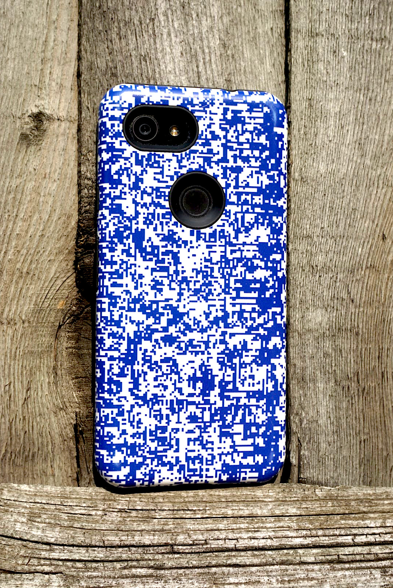
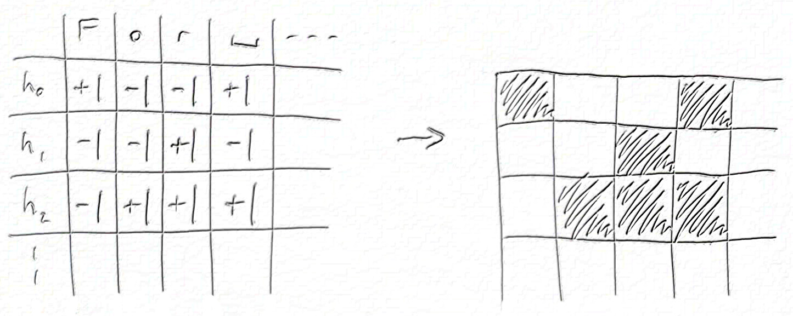
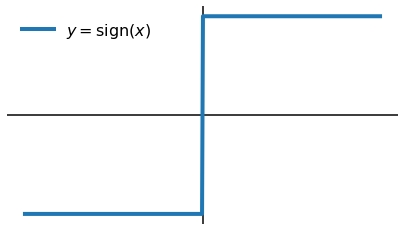
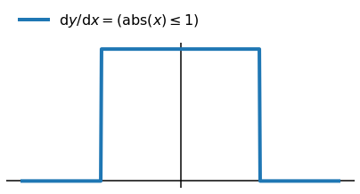
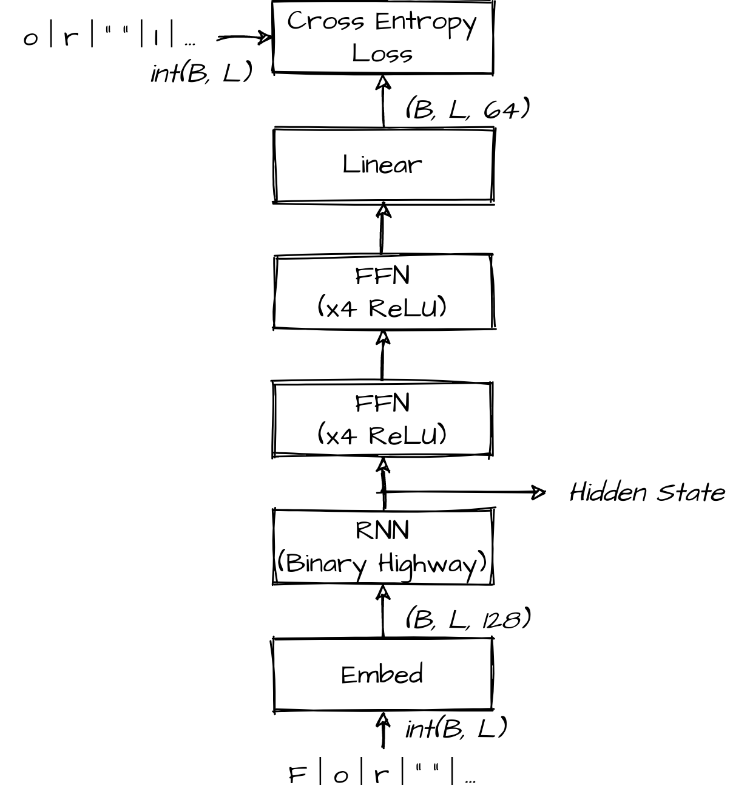
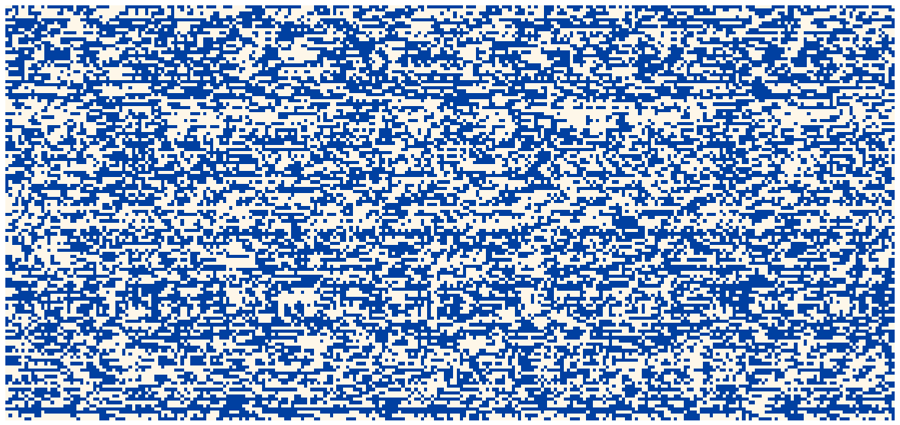
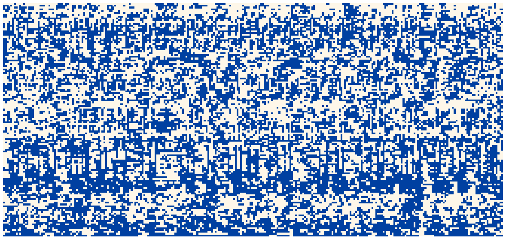

title: My phone case, the hidden state of an RNN
keywords: deep-learning,visualisation,rnn,nlp

# My phone case, the hidden state of an RNN

What I needed was a new phone case. But I wanted a case that declares “my owner is a nerdy deep learning engineer”. So I made a visualisation of an RNN and had it printed, and I’m quite happy with it. This post is the origin story of this case, or, how to mash together a book, a deep learning library, some free computer time and a layout algorithm to get a pretty bunch of pixels.

Here’s the final product. Not to everyone’s taste, I’m sure, but you’ve gotta love your own.




## Vision

My old phone case was battered and broken, and I wanted something a little different to replace it, an image related to my craft of deep learning for natural language processing (NLP).

I had to decide what to visualise, the attention maps of a [Transformer](https://arxiv.org/abs/1706.03762) or the hidden state of an [recurrent neural network](http://www.wildml.com/2015/09/recurrent-neural-networks-tutorial-part-1-introduction-to-rnns/) (RNN). Transformers are wonderful beasts, well-connected powerhouses of NLP and oh so hyped. But I have a soft spot for old-fashioned RNNs. One interesting thing about RNNs is that they have an information bottleneck. An RNN is able to summarise the whole history of what it has read in a single vector, called the hidden state. **I wanted to see how this state evolves over time**.

A hidden state is usually a vector of real numbers. But to give my RNN a harder job, I restricted it to a **binary vector** of {-1, +1}. So I would allow my RNN only 128 bits to store a memory of what it has already seen and provide a signal to predict the next character. Maybe the real reason was I only wanted to pick two colours.

The end result should be a grid of pixels like this:




## Training a model

Modeling and training was mostly standard for a [character RNN](http://karpathy.github.io/2015/05/21/rnn-effectiveness/), so here are the key points before I talk about the interesting bits:

- **Task**: Autoregressive forward character language modeling
- **Dataset**: The Bible (KJV)
- **Vocabulary**: All Unicode characters in dataset
- **Training/validation split**: By book, validation={Romans}, training={others}
- **Optimisation**: Adam, LR=10<sup>-3</sup>, batch=32, sequence length=512, steps=10<sup>4</sup>
- **Framework**: PyTorch
- **Platform**: Google Colab (GPU)

The fun bit was trying to learn a binary hidden state. It’s easy to make a binary nonlinearity in PyTorch, `T.sign(x)` will do it. The problem is that there’s no gradient flow. If you look at the sign function the problem is obvious:



The gradient is zero everywhere, except at x=0, where it’s undefined. To fix this, I relaxed the backward pass to:



This was a total cheat, I lied about my gradient to autograd and I have no excuse. But this is deep learning so I got away with it and the model still converged. I think what happens is that the fake gradients help the optimiser explore the transition around x=0. Maybe if things went badly I’d see some oscillation, but in this case it all turned out OK.

Here’s what that looks like in PyTorch:

```python
class RelaxedBinaryGate(T.autograd.Function):
   @staticmethod
   def forward(ctx, input):
       ctx.save_for_backward(input)
       return T.sign(input)

   @staticmethod
   def backward(ctx, grad_output):
       input, = ctx.saved_tensors
       return grad_output * (T.abs_(input) <= 1)
```

I used this nonlinearity in a RNN cell based on the recurrent highway network,

$$\begin{align}
h^{t+1} &= \mathrm{RelaxedBinaryGate} \left( \sigma(\mathrm{carry}) \odot h^t + \sigma(\mathrm{update}) \odot \mathrm{candidate} \right), \\\\
\mathrm{carry}, \mathrm{update}, \mathrm{candidate} &= \mathrm{split} \left( U h^t + W x^t + b \right),
\end{align}$$

where $\sigma(z)$ is the logistic sigmoid nonlinarity and $\odot$ denotes elementwise product. I put this RNN into a model that looked like:



After a bit of tinkering it worked. Final validation performance was 1.9 bits/char, which is bad, but it's at least achieving something with the hidden state. It’s easy to beat this figure with regular nonlinearities, stacked RNNs, wider hidden states, etc., but that’s not the game!


## Sorting hidden units

I chose some of my favourite verses to feed into the model, [Romans 1:16-17](https://www.biblegateway.com/passage/?search=romans+1%3A16-17&version=KJV), and saved the binary hidden state after each character. It looked like this:



Each of the 128 rows are hidden units, and each of the 274 columns is a character in the verse. I thought this should be it. But I had forgotten that the ordering of rows in this picture is arbitrary. As with most neural networks, I could permute a few matrices in my model and the order of the hidden components would change, even though the model behaves identically. So the question arose: **if I can choose any order, which is the most beautiful or insightful?**

The obvious thing is to try to put similar hidden components together, so I had a play around with that. It took me a while to realise, but it turns out I was inadvertently trying to solve the **travelling salesman problem** (TSP). If I had taken the time to write it out, I was trying to solve this optimisation:

&emsp; Choose a permutation of indices $Z$ to maximise $\sum_i(\mathrm{similarity}(x_{z_i}, x_{z_{i+1}}))$.

After finally recognising this was a TSP, I looked for approximate solutions and tried [this one from stack overflow](https://stackoverflow.com/questions/25585401/travelling-salesman-in-scipy). But in the end I went for this greedy algorithm which was most visually appealing:

```
solution[0] = argmin(mean(states))
solution[1] = argmax(mean(states))
for next <- states ordered by (abs . mean) ascending
    dest = argmax_{i} [
        similarity(solution_{i-1}, dest) + similarity(dest, solution_{i})
        - similarity(solution_{i-1}, solution_{i})
    ]
    solution <- solution[:dest] + [next] + solution[dest:]
end
```

The idea is to first pick a fixed start and end and an overall order for considering states. Then at each step, insert the next state at the location with the best total similarity. This algorithm gave me my row order, so finally, I was done:



I'm not sure there's much substantial insight to be gained from this visualisation, but it does the job of decorating a phone. Hidden units in this model show strong temporal correlation - the states are somewhat "sticky" (looking left-right along a single row). But this is no surprise given the RHN cell definition, which bakes this into the update rule. Also, some groups of units transition at the same point in time (looking up-down along a single column), an effect that is enhanced by the similarity-based row ordering.


## Final thoughts

All that remained was to get it printed. I used [this company](https://uk.casestation.com/) (no affiliation) and it seems well done but I’m sure there are many other good options.

As you’ve probably gathered, I’m very happy with my case. Making it has taught me that I should step back early and think about the problem I’m working on. Who knows, it might be NP-hard. I’ve also learnt that I can lie about my gradient with impunity, the optimizer can muddle through. You’ve got to love deep learning!


---

## References & materials

 - Training notebook: [GitHub](https://github.com/DouglasOrr/DouglasOrr.github.io/blob/examples/2021-09-phone-case/phone_case_train.ipynb), [Colab](https://colab.research.google.com/github/DouglasOrr/DouglasOrr.github.io/blob/examples/2021-09-phone-case/phone_case_train.ipynb)
 - Visualisation notebook: [GitHub](https://github.com/DouglasOrr/DouglasOrr.github.io/blob/examples/2021-09-phone-case/phone_case_viz.ipynb), [Colab](https://colab.research.google.com/github/DouglasOrr/DouglasOrr.github.io/blob/examples/2021-09-phone-case/phone_case_viz.ipynb)
 - Transformer: [Attention is all you need](https://arxiv.org/abs/1706.03762), _Vaswani A, Shazeer N, Parmar N, Uszkoreit J, Jones L, Gomez A N, Kaiser Ł, Polosukhin I._
 - RNN (LM): [Recurrent neural network based language model](https://www.fit.vutbr.cz/research/groups/speech/publi/2010/mikolov_interspeech2010_IS100722.pdf), _Mikolov T, Karafiát M, Burget L, Černocký J, Khudanpur S._
 - RHN: [Recurrent highway networks](https://arxiv.org/abs/1607.03474), _Zilly J G, Srivastava R K, Koutnık J, Schmidhuber J._
