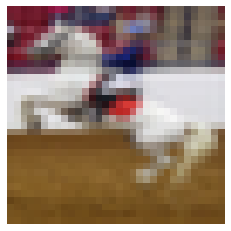
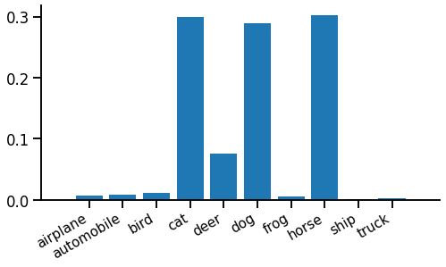
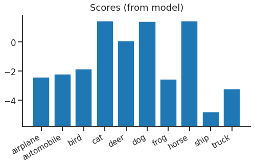
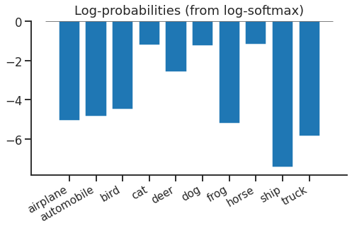
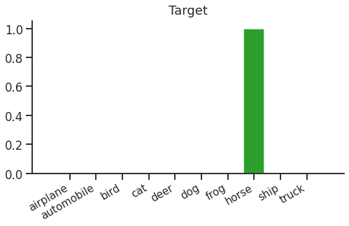
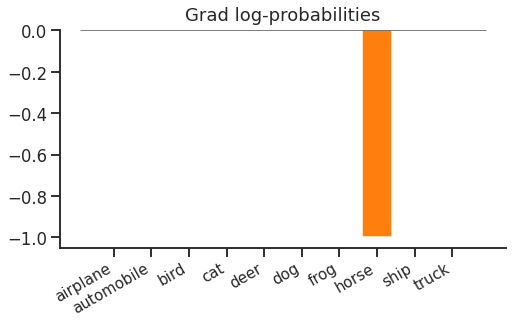
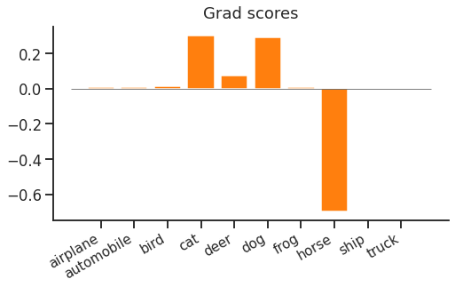

title: Softmax Cross Entropy Loss
keywords: deep-learning,training,tutorial

# How to train your classifier

This is a short series of "deep dives" into training objectives. In each post we'll try to motivate and explain a training objective, finishing by looking at the critical gradient information they provide back to the model. I've enjoyed preparing these & hope you find something useful here too.

 1. **Softmax Cross Entropy Loss**
 2. [Teacher-Student Training](../2-teacher/article.md)
 3. [Sampled Softmax Loss](../3-sampled/article.md)
 4. [Value Function Estimation](../4-value/article.md)
 5. [Policy Gradient Estimation](../5-policy/article.md)
 6. [Review - try them for yourself](../6-review/article.md)


## Softmax cross entropy loss

If you’ve tried deep learning for yourself, I’d guess you’ve trained a model using softmax cross entropy loss. It’s so overwhelmingly popular I thought I might write a series of blog posts to remind myself there are other options out there.

But we'll start with softmax cross entropy. If you already know why it is defined as it is and what the forward and backward passes look like, feel free to skip on through the list above. But if like me you're due a refresher, read on.

In this article, we'll think through the core idea of softmax cross entropy loss, see how to add it to a PyTorch model, and finally look at what happens under the hood when we use it. I'll assume you already know some core deep learning concepts - e.g. what a forward pass, backward pass and loss function is.


## Core idea

Imagine we’re using deep learning to find a function to classify images "is it a plane? / bird? / horse? etc." Our plan is to choose a parameterised function with random initialisation and take steps to minimise a loss function by updating the parameters using gradient descent. So an immediate problem is how to choose this loss function.

For example, here’s an input image:



Our function should classify this as a horse. We can give our function one penalty point if it gets it wrong, and nothing if it's right - error rate. Unfortunately, error rate isn’t continuous - we’re either wrong (e.g. if we said dog) or right (if we said horse). It’s hard to optimise such a hard right-or-wrong outcome, so we _relax_ our outputs & change our function to predict a probability distribution over all the possible labels for the image.

> "Relax" in this context essentially means - hey there, function, chill on this "horse" business a bit; it might be a large dog, after all.

The relaxed output might look like this:



The height of each spike is the probability of that label. In this case the function is pretty confident the image is either a cat, dog or horse, but not very sure which.

Now we have two problems left. First, we need our function to produce something that obeys the rules of a probability distribution. Each output must be positive, and all outputs must sum to 1. One easy way to do this is the softmax function. Softmax applies each rule in turn to "brute force" any input into a probability distribution output. First to make each output positive, we exponentiate, $z\\!=\\!e^x$. Then to make sure the outputs sum to one, we divide by their sum, $y=z\,/\\!\sum\\! z$. Putting this together we have the softmax function:

$$y_i = \frac{e^{x_i}} {\sum_j e^{x_j}}$$

The second problem is to define a loss function that compares our model function’s probability output against a target label and tries to make them as similar as possible. To do this, we imagine that the true labels are actually single samples from a true probability distribution, which says "given this bunch of pixels, it’s a horse 90% of the time, a dog 6% of the time, etc…".  A reasonable way to compare two probability distributions, one of which is known, the other only provides samples, is cross entropy. We can think of it as the surprise seeing the true label, given a prediction from the model function. The cross entropy between our function and reality will be minimised when the probabilities exactly match, in which case cross entropy will equal reality’s own entropy.

Putting this together, we apply softmax then take cross entropy against a single target sample $t$, which is the _softmax cross entropy_ loss function:

\begin{equation}
L(x, t) = -x_t + \log \sum_i \\!e^{x_i}
\label{eqn:loss}
\end{equation}

Fortunately, using this loss function is a bit easier than motivating it...

## PyTorch implementation

Adding a softmax cross entropy loss at the end of a PyTorch model is very easy. They don't even make you type "softmax"...

```python
labels = ...
outputs = ...

loss = T.nn.functional.cross_entropy(outputs, labels)
print(float(loss))
loss.backward()
```

The model produces `outputs`, which are typically shaped `(batch x num_classes)`, and the function `T.nn.functional.cross_entropy` (or alternatively the module `T.nn.CrossEntropyLoss`) implements the softmax + cross entropy equation \eqref{eqn:loss}.

## What does it do?

In the forward pass, we start with a vector of floating point numbers from our model. We can think of these as scores for each class:



Because of the next step, the absolute values of the scores don't mean anything and there's nothing special about zero.

Looking at equation \eqref{eqn:loss} above, we see that softmax + cross entropy is actually the same as log(softmax) + lookup + negation. It turns out this is an easier way to follow through the logic. First we apply log-softmax to our scores, turning them into log probabilities. This means if you exponentiate & sum them, you’ll get 1. These log probabilities look like this:



Log softmax hasn’t done anything complex - it has shifted everything down by the same amount so that if you exponentiate & sum, you’ll get 1.

The final step in the forward pass is lookup & negation. We just need to look up the log-probability of the true label ("horse"), negate it, and we have our cross entropy loss for this example. We can think of the lookup as a dot product with a "one hot" target distribution that looks like this:



Dot-product this target vector with our log-probabilities, negate, and we get the softmax cross entropy loss (in this case, `1.194`).

### The backward pass

Now we can get to the real business of the loss function. The point of the loss is to provide gradients to update the parameters in our model. Let’s walk through back through the gradients.

The first step is to get gradients with respect to log-probabilities. This is easy - from the lookup (or dot product) and negation, we get:



Just a (flipped) one-hot vector again. Cross entropy loss only cares about the probability of the correct label "horse", nothing else. You could increase the probability of a non-target "dog", and as long as you fix the probability distribution without changing the probability of the target "horse", there would be no change in the loss.

Next, we backpropagate through log-softmax to find the gradient with respect to scores:



Now if you increase the score of a non-target "dog", the loss would increase. This is because of the softmax normalisation term - if you increased the "dog" score, all other log-probabilities would decrease by the same amount, which means the "horse" log-probability would decrease and the loss increases.

If we check the gradient equation, we notice a couple of interesting things:

$$\frac{dL}{dx_i} = p_i - \delta_{it}$$

Here, $p_i$ is the (softmax-ed) predicted probability of class $i$, ($p_i = \mathrm{softmax}(x)\_i$), and $\delta_{it}$ is the Kronecker Delta (1 when the indices are equal, otherwise 0). The first thing to notice is that only the correct class $t$ has a negative gradient, all the other classes have a positive gradient. This means that softmax tries to push up the score of the correct class, and push down all other scores. High probability incorrect classes are pushed down more than low probability ones, which makes intuitive sense.

The second thing to notice is that the gradient must sum to zero ($\sum_i p_i =\\! 1$ and $\sum_i \delta_{it} = 1$). This means that the gradient below the axis for the correct class is balanced by the same total gradient above the axis and spread across all incorrect classes.

Finally, the magnitude of the gradient depends on the probability of the target class, as the total probability above and below the axis is $1-p_t$. This makes intuitive sense - if the probability of the target class is 1, the loss is already minimal so no update is needed. But if the probability of the correct class is small, the model should get a large update.

These observations can motivate some variations on softmax cross entropy. One tries to provide positive updates to more classes with a richer target distribution ([teacher-student training](../2-teacher/article.html)). Another tries to optimise the computation using sparse negative updates for incorrect classes ([sampled softmax](../3-sampled/article.html)).

## Wrap up

We’ve seen softmax cross entropy, motivated as a reasonably obvious way to relax and train a classifier. Most importantly, we looked at the gradient updates it feeds back to the function being trained. It’s hard to beat it as a general purpose training objective for classification, so in the rest of the series we’ll look at a few variations that make sense in specific situations. For now, though, softmax cross entropy enjoys market dominance and that looks to continue for years to come.

<ul class="nav nav-pills">
  <li class="nav-item">
    <a class="nav-link" href="../2-teacher/article.html">Next - teacher-student training</a>
  </li>
  <li class="nav-item">
    <a class="nav-link" href="/index.html#classifier-training-objectives">Up - index</a>
  </li>
</ul>

## References

 - Softmax: [Multi-Category Classification by Soft-Max Combination of Binary Classifiers](http://www.gatsby.ucl.ac.uk/~chuwei/paper/smc.pdf), _Duan K, Keerthi SS, Chu W, Shevade SK, Poo AN._
 - CIFAR-10: [Learning multiple layers of features from tiny images](https://www.cs.toronto.edu/~kriz/learning-features-2009-TR.pdf), _Krizhevsky A, Hinton G._
