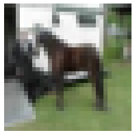
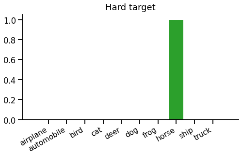
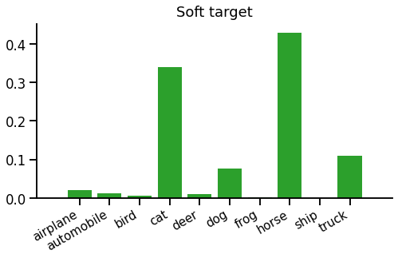
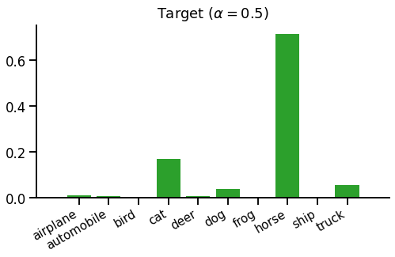
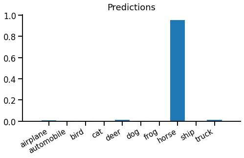
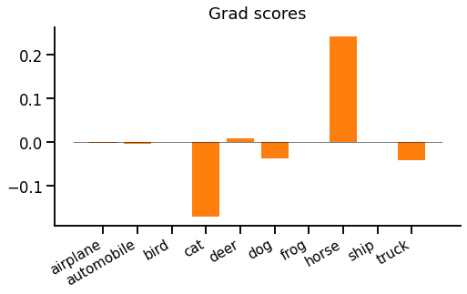

title: Teacher-Student Training
keywords: deep-learning,training,tutorial

# Teacher-Student Training (aka Knowledge Distillation)

Teacher-student training is a technique for speeding up training and improving convergence of a neural network, given a pretrained "teacher" network. It's very popular and effective, commonly used to train smaller, cheaper networks from larger, more expensive ones.

In this article, we'll think through the core idea of teacher-student training, see how to implement it in PyTorch, and finally look at what actually happens when we use this loss. This is part of our series on [training objectives](../1-xent/article.md), and if you're not familiar with softmax cross entropy, [our introduction](../1-xent/article.html#softmax-cross-entropy-loss) to that would be a useful pre-read.


## Core idea

When we looked at the softmax cross entropy loss function with a one-hot target, we saw that the gradient looked "spiky". Each example in a batch contributes a large gradient spike to increase the score of the correct label, and a flatter gradient across all other labels. If we look at any individual example, it is trying to make the target probability 1 and everything else 0 - this would minimise the loss for that example.

But there's a conflict here. We don't actually expect (or even want) such a spiky output from our model. Instead, we'd expect an output to hedge it's bets a bit. For example, given this image:



You could expect a model to predict something like "horse 80%, dog 20%". But if we use standard softmax cross entropy loss, the target distribution looks like this:



This means that the prediction "horse 100%, dog 0%" would minimise softmax cross entropy loss, since it is actually a picture of a horse. Intuitively, this seems a bit over-confident.

If training with softmax cross entropy loss, we can mitigate this problem by making sure there is enough input data, that examples well-shuffled into batches, and there are regularisers such as dropout that prevent the model from becoming over-confident. But teacher-student training provides another option.

**Teacher-student training provides a richer and more realistic target distribution than a single spike.** Instead of training the model to predict "horse 100%, dog 0%", it can train the model to predict "horse 80%, dog 20%" on a single example. Given a target distribution, we can still use softmax cross entropy as a loss function - the only difference is that the target is not a single-sample "hard" spike but a full "soft" distribution over all classes, like this:



**But how do we get a soft target distribution?** In general, we can't use the dataset directly. If the dataset's input features are pixels or long sentences, it's unlikely there will be multiple output samples for the same input, as the input space is too large. We would need a vast amount of data to estimate a target distribution directly. So we use another model called the _teacher_.

Before we can train the model we're interested in, called the _student_, we must train the teacher. We first train the teacher using a standard loss (e.g. "hard" softmax cross entropy). Then we can train the student using our new teacher-student loss function. Instead of fully trusting the teacher, we'd usually create a mixture of the standard one-hot objective and the teacher's distribution, like this:



This distribution is just a 50-50 mixture of the above hard and soft targets.

> In teacher-student training, the dataset provides hard targets (a single target label) and the teacher provides soft targets (a distribution over all labels).

Putting it together, the teacher-student loss function (used to train the student) looks like this:

\begin{equation}
L(x, t) = \mathrm{CE}\left(\alpha \cdot \mathrm{teacher}(x) + (1-\alpha)\cdot\delta_{t*}\;,\; \mathrm{student}(x)\right)
\label{eqn:loss}
\end{equation}

Where $CE(t,s)$ is the softmax cross entropy loss function between target distribution $t$ and predicted scores $s$, and $\alpha$ is an interpolation coefficient (usually a fixed hyperparameter) that interpolates between plain one-hot loss ($\alpha\\!=\\!0$) and pure teacher matching ($\alpha\\!=\\!1$). Note $\delta_{t*}$ is the Kronecker delta, i.e. a one-hot vector at index $t$.

_(Note - you will sometimes see [KL divergence](https://en.wikipedia.org/wiki/Kullback-Leibler_divergence) in place of cross entropy loss. It shouldn't make a difference to training, however - as the gradient update provided by $D\_{KL}(\mathrm{target}||\mathrm{predictions})$ is the same as cross-entropy.)_

### Why bother?

One problem with teacher-student training is that you have to train a teacher model as well as the student. If the teacher and student are exactly the same model (except for initialisation), it all seems a bit pointless! We could reasonably assume the student will only ever match the performance of the teacher, although it should get there faster. Since we had to train the teacher anyway, we may as well just use that, and forget about training the student entirely. It should perform just as well and save overall training time.

The usual way around this problem is to train models of different sizes. Experiments show that you can get better results for a given student model by training with a larger teacher than if you train the student directly on the dataset. This means that you can get a model that's cheaper to query for predictions since it's smaller than the teacher, but has higher accuracy than a model trained directly on the dataset. This is the origin of the term **knowledge distillation**. The superior knowledge of the richer teacher can be distilled into the smaller student using the teacher-student objective.

To draw this together, teacher-student training of classifiers (usually) means:

 1. Train a large teacher model using one-hot softmax cross entropy.
 2. Define a target distribution which mixes hard targets from the dataset with soft targets from the teacher.
 3. Train a smaller student model on softmax cross entropy against this mixed target.


## PyTorch implementation

Teacher-student training is straight-forward to implement. First you have to train the teacher, using standard objectives, then use teacher's predictions to build a target distribution while training the student. The student phase looks like this:

```python
inputs, labels = ...
model = ...
teacher = ...
alpha = 0.5

with T.no_grad():
    soft_target = T.nn.functional.softmax(teacher(inputs))
    hard_target = T.arange(soft_target.shape[-1]) == labels[..., np.newaxis]
    target = alpha * soft_target + (1 - alpha) * hard_target

outputs = model(inputs)
logprobs = T.nn.functional.log_softmax(outputs)

loss = T.nn.functional.kl_div(logprobs, target, reduction='batchmean')
print(float(loss))
loss.backward()
```

It's best not to keep training the teacher by accident - in PyTorch this means wrapping the teacher's prediction in `T.no_grad()`. Notice we're using KL divergence as a loss function - the PyTorch API encourages you to do this, but it will produce the same gradients as cross entropy.

_Note: an alternative (equivalent) implementation would be to use `T.nn.functional.kl_div` for `soft_target`, `T.nn.functional.cross_entropy` for `hard_target`, and mix the losses rather than the distributions._


## What does it do?

_We'll skim over some of the fine details here, when they're common to plain (one-hot) softmax cross entropy - see [this description](../1-xent/article.html#what-does-it-do) for more on that._

Our student produces scores. These are normalised using log-softmax for computing the loss, or softmax to get the prediction distribution:



Evidently the model is very confident, maybe overconfident, that this image is a horse.

We've already seen how the target distribution is constructed by mixing hard and soft targets. To recap:


Running equation \eqref{eqn:loss} to compare predicted and target distributions, we get the cross entropy loss `1.89` (or a KL divergence loss `0.946`).

### The backward pass

The backward pass is really the important bit, after all, so let's look at that... The gradient with respect to scores is surprisingly simple:

$$\frac{dL}{dx_i} = p_i - t_i$$

Where $x_i$ is the score, $p_i$ is the predicted probability (computed from $x_i$) and $t_i$ is the target probability, for class $i$.

In our example, the gradient w.r.t. scores looks like this:



We might be surprised by a strong positive gradient for "horse". This means that the loss is trying to push down the "horse" prediction, even though this is actually the correct label from the dataset. It's the teacher's fault - the teacher thinks the student is overconfident and should be sharing out some probability to other classes, especially "cat", "dog" and "truck".

A couple of observations. First, there is always the same positive and negative gradient mass (as both $p$ and $t$ are probability distributions which sum to 1). Unlike one-hot softmax cross entropy, however, there can be multiple positive and negative gradients. Second, the gradient magnitude depends on the absolute difference between $p$ and $t$, which makes intuitive sense.


## Wrap up

That's teacher-student training, most commonly applied as knowledge distillation. It can be motivated as a less "spiky" objective than one-hot softmax cross entropy. We saw what kinds of gradients to expect, that even the correct class can receive a positive loss gradient, and the gradient is zero when the student agrees with the mixed target.

The most common scenario for teacher-student is **optimising for inference/predictions**, where we want maximum prediction quality for minimum prediction runtime. To achieve this we're willing to spend extra training time on a large teacher and then use the teacher-student objective to train a better compact student model than we could have done from scratch.

<ul class="nav nav-pills">
  <li class="nav-item">
    <a class="nav-link" href="../3-sampled/article.html">Next - sampled softmax</a>
  </li>
  <li class="nav-item">
    <a class="nav-link" href="../1-xent/article.html">Up - index</a>
  </li>
</ul>


## References

 - Knowledge Distillation: [Distilling the Knowledge in a Neural Network](https://arxiv.org/abs/1503.02531), _Hinton G, Vinyals O, Dean J._
 - CIFAR-10: [Learning multiple layers of features from tiny images](https://www.cs.toronto.edu/~kriz/learning-features-2009-TR.pdf), _Krizhevsky A._
