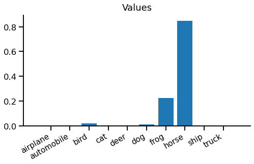

title: Value Function Estimation
keywords: deep-learning,training,tutorial

# Value Function Estimation

Value function estimation is a key component of many reinforcement learning (RL) algorithms. It can optimise a model indirectly, without being told the right answer during training.

This is part of our series on [training objectives](/index.html#classifier-training-objectives), where we're looking at various objectives to use to train a (deep learning) classifier. Having looked at minor variations on softmax cross entropy, this is our first major departure. Now we'll try something considerably harder - to train our classifier without being told the right answer directly.


## The new game

Before we look at value function estimation, we need to understand that it isn't "playing the same game" as softmax cross entropy.

The old game is **supervised learning for classification**. The goal is to predict the correct label "airplane" or "automobile" or "bird" for each image in a test. Your score is the percentage of images correctly labelled, given some unknown target labelling. To prepare for the test, you're given a large set of images, alongside their target labels, which you're free to use in any way you like.

```
# Supervised learning
  Find:         predict(x) -> y
  To maximise:  sum [ metric(predict(x), y) ] over {(x, y)}_test
  Given:        {(x, y)}_train
```

The new game is **multi-armed contextual bandit learning**. You're shown an image and must choose "airplane", "automobile" or "bird". After choosing one, you are given a reward if you got it right, and no reward if you got it wrong. You aren't told the target answer, only whether you got a reward or not. There is also no separate test phase, training & test are a single phase, and you're graded as you learn.

```
# Multi-armed contextual bandit learning
  Find:         predict(x) -> a
  To maximise:  sum [ reward(predict(x)) ]
  Given:        reward(a) after each step
```

## Core idea

Value function estimation is a technique designed for bandit problems and their more complex cousin, reinforcement learning. But in this article, we'll apply it back to our standard supervised learning problem we've used so far in our series. This means we can focus on the new type of loss without having to worry about other aspects of bandits / RL.

The core problem we need to solve is to create a _reward-based loss_ rather than a _target-based loss_. A reward-based loss is given feedback for the chosen prediction "was I right or wrong?", while a target-based loss is given the correct answer "was it a horse, cat, bird, etc?" Evidently, a reward-based loss is a harder problem since you're given less information to help you learn.

For example, you're shown this image:


Your prediction for this image is "dog". With a target-based loss, you're told:

> "It's a horse."

With a reward-based loss, you're only told:

> "No, it's not a dog."

So a reward based loss makes the task harder: when you get it wrong you just have to keep guessing until you get it right. Since these predictions now interact with the loss, we call them _actions_. An action is just a prediction with consequences.

### Value functions

The idea of value function estimation is to predict how much reward to expect for each action you could take. For example, a value function could predict a large reward for choosing "horse" but a small possibility of reward for choosing "automobile". If you can train an accurate value function, finding the best action is easy - just choose the action with the largest predicted reward.

> Value function estimation means predicting how much reward to expect for each action you could take.

We now solve the bandit problem indirectly, by learning a value function instead of an action predictor. The benefit is that it's now a supervised learning problem, since we are directly given the reward we should have predicted.

The value function $f$ returns a vector of values $v$ for each action $a$, $v_a = f(x)$. Whenever we take an action & receive a reward $r$, we remember which action we took and optimise a loss function $L(v_a, r)$. In our example, the loss function will be binary cross entropy with a sigmoid nonlinearity, which is very similar to softmax cross entropy (seen [previously](../1-xent/article.md)), with two output classes.

### Policies

The final thing we need is a way to choose actions based on values. This is called a _policy_. One possible policy is to always choose the one with the largest reward prediction:

\begin{equation\*}
\hat{a} = \mathrm{argmax}_a \, \left[ \, f(x) \right]_a
\end{equation\*}

This is called a _greedy_ policy, because it greedily chooses the best-looking option.

Greedy policies like this suffer from a problem - it is easy for them to get stuck during training. Imagine we have a set of images that look quite similar to our network. After training a few images, "dog" has value 0.2, while "horse" still has an initial value 0.1. Using the greedy policy above, we would always choose "dog", and may not discover that "horse" has a much higher value for some of these images. This problem is a lack of exploration - since we always exploit our current best prediction we don't explore possibilities that may be even better.

To address this, we can add random exploration. The simplest way is to randomly choose either to follow the greedy policy above or a simple uniform random policy. This is called an _epsilon-greedy_ policy.

\begin{equation}
\hat{a} =
\begin{cases}
\mathrm{argmax}_a \, \left[ \, f(x) \right]_a & \textrm{with probability } 1-\epsilon \\\\
a \sim \mathrm{uniform}() & \textrm{with probability } \epsilon
\end{cases}
\label{eqn:policy}
\end{equation}

Drawing it together, we'll need the following:

 - A value function network that predicts a value for each action
 - A policy that chooses actions based on values
 - A loss function between predicted value and actual reward

## PyTorch implementation

A PyTorch implementation of value function estimation is reasonably straight-forward. The main difference versus supervised training is implementing a policy to select an action, and obtaining a reward to use as the target for a regular loss function.

_Note that this is a slightly odd example, since we're applying a bandit algorithm to a supervised learning problem - if we were solving a true bandit problem, the reward calculation be a more complex / completely separate system, for example a simulation or natural system._

```python
inputs, labels = ...
model = ...
epsilon = 0.2
batch_size = inputs.shape[0]

# 1. Predict values for each possible action
value_logits = model(inputs)

# 2. Use a policy to select an action & obtain reward
with T.no_grad():
    actions = T.where(
        T.rand(batch_size) < epsilon,
        T.randint(high=value_logits.shape[1], size=(batch_size,)),
        T.argmax(value_logits, -1)
    )
    rewards = (actions == labels).float()

# 3. Train the selected action's value
action_value_logits = value_logits[T.arange(batch_size), actions]
loss = T.nn.functional.binary_cross_entropy_with_logits(
    action_value_logits, rewards
)
print(float(loss))
loss.backward()
```

**1. Predict values for each possible action:** Nothing special here - we run our model and get a vector of value logits for each possible action. Hold on for an explanation of the word _logit_, for now think of them as scores.

**2. Use a policy to select an action & obtain reward:** Implement an epsilon-greedy policy following equation \eqref{eqn:policy}, to choose one action for each element of a batch. In this case an action is just an integer. Then, obtain a reward for the chosen action, in this case by comparing with the known target label. This is all wrapped in a `T.no_grad()`, demonstrating that there is no gradient flow here.

**3. Train the selected action's value:** From this point, it's just regular supervised learning. The only unsual thing is that there is only a target for one of the predicted values, corresponding to the action that was chosen in step 2. There is no loss or gradient for any other predicted value. The loss function is chosen to match the task. In this case the reward is either 0 (wrong prediction) or 1 (correct prediction), so binary cross entropy with a sigmoid nonlinearity is the obvious choice.


## What does it do?

In the forward pass, we start with a vector of value _logits_, one for each action we could take. [Logits](https://en.wikipedia.org/wiki/Logit) are similar to the scores provided to softmax cross entropy loss, but have an absolute scale. where logits $[-\infty, 0, +\infty]$ corresponds to the probabilities $[0, 0.5, 1]$.

Here are our value logits for the horse image we saw earlier:


We can see most of them are below zero, but there is a positive logit for "horse". These are slightly hard to interpret in this form, so we can turn them into values, which are between 0 and 1, using the [logistic sigmoid function](https://en.wikipedia.org/wiki/Logistic_function):



Now we can step into the imaginary shoes of our network and see what it's thinking when it sees this image.

> Hmm, if I choose "horse", I'm 85% confident in being right - I should get a good reward for that. If I choose "frog", I'm only 23% confident in being right - not so good. But "everything else is pretty much hopeless - there's virtually no chance it's a "truck"!

You might notice the network isn't very logical - 85% chance of being right for "horse" + 23% chance of being right for "frog" = 108% chance of it being a "horse or frog". There is a simple fix for this, which we'll leave as an exercise for the reader.

We still need to choose an action, so we fire up our policy. We're using an epsilon-greedy policy (equation \eqref{eqn:policy}) with $\epsilon=0.2$, so the total probability of each action looks like this:


It might be somewhat surprising that we're just as likely to choose "truck" as "frog", but that's epsilon-greedy in action - only the best value matters.

From now on we'll split and imagine two scenarios. One where we follow our greedy policy and pick "horse" and another where we follow the random policy and pick "frog". Let's recap our predicted value and see what reward we get:


On the left, we choose the correct action "horse", we get a reward of 1. Our loss function target is same as the reward. On the right, we choose an incorrect action "frog", and get a reward and loss target of 0. We now have a differentiable prediction and a target, so it looks ready for regular supervised learning.

### The backward pass

If we pass these predictions and targets into a binary cross entropy loss, we get the following loss gradients with respect to the relevant action logit:


On the left, when we choose "horse" we get a negative gradient to increase the value of "horse" and no gradient for any other action. On the right, when we choose "frog" we get a positive gradient to decrease the value of "frog" and no gradient for any other action.

_Since the gradient calculation isn't directly related to value function estimation, we won't go into full details here._

Note that although we made ten predictions, we only get to train one of them, corresponding to the action our policy chose. We simply didn't get any reward feedback for any other action, so haven't learnt anything about them and cannot update their value functions.


## Wrap up

Phew - that was quite a journey. We found a new game for our network to play, called multi-armed contextual bandit learning. This replaced the target-based loss with a reward-based loss, where we're only told if our guess was right, not what the right answer was. We looked at a simple way to solve this problem, where we learn a value function to predict how much reward we expect to get. We combined this with an epsilon-greedy policy to select actions.

We applied this to a contrived problem of correctly labelling CIFAR-10 images. Since the dataset already contains a set of ground truth target labels there really is no practical point in making the problem harder using a reward-based loss rather than a target-based loss. But it makes for a simple example.

Value function estimation is a simple and useful technique to help solve contextual bandit or reinforcement learning problems. Since it can be used with any policy and provides an interpretable value prediction, it's a handy component to incorporate into other learning algorithms e.g. policy gradient.

<ul class="nav nav-pills">
  <li class="nav-item">
    <a class="nav-link" href="../5-policy/article.html">Next - policy gradient estimation</a>
  </li>
  <li class="nav-item">
    <a class="nav-link" href="/index.html#classifier-training-objectives">Up - index</a>
  </li>
</ul>


## References

 - Value functions in RL: [Policy Gradient Methods for Reinforcement Learning with Function Approximation](https://papers.nips.cc/paper/1999/hash/464d828b85b0bed98e80ade0a5c43b0f-Abstract.html), _Sutton S, McAllester D, Singh S, Mansour Y._
 - CIFAR-10: [Learning multiple layers of features from tiny images](https://www.cs.toronto.edu/~kriz/learning-features-2009-TR.pdf), _Krizhevsky A, Hinton G._
