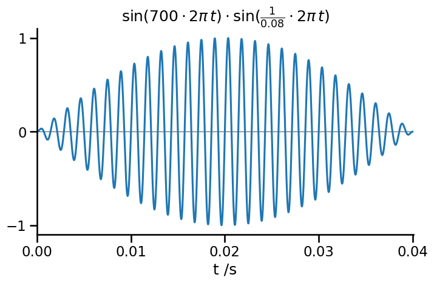
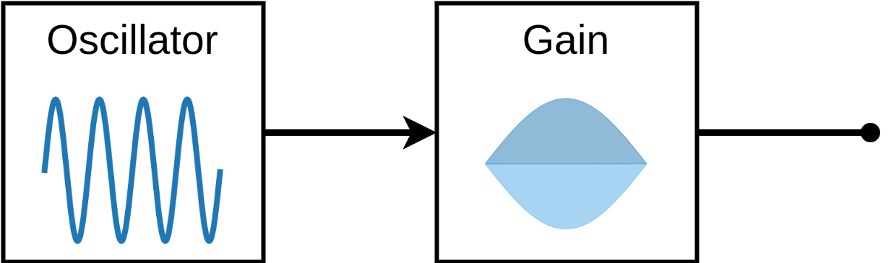
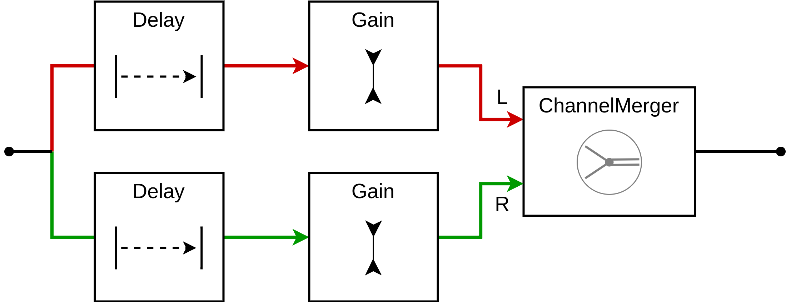

title: Rasterised ray tracing of sound in JavaScript
keywords: javascript,audio,sound,webaudio,game

<script src="demo/demoecho.js"></script>
<link rel="stylesheet" href="demo/style.css">

# Rasterised ray tracing of sound in JavaScript

In my recent Game Jam game, [FAD](https://douglasorr.itch.io/fad), the player controls a submarine navigating a 2D pixelated world that they can’t see. To do this they eventually get to use an active sonar ping. Here’s how it sounds (and looks in “cheat mode”):

<div id="demo-main" class="demo-box" tabindex="0">
    <canvas class="demo-game-canvas"></canvas>
    <div>
        <div class="demo-game-controls">
            <div class="demo-game-control-up demo-button"><span>&#x2191;</span> W</div>
            <div class="demo-game-control-left demo-button"><span>&#x2190;</span> A</div>
            <div class="demo-game-control-down demo-button"><span>&#x2193;</span> S</div>
            <div class="demo-game-control-right demo-button"><span>&#x2192;</span> D</div>
            <div class="demo-game-control-ping demo-button">SPACE</div>
        </div>
    </div>
    <footer>#1 Demo <span class="demo-reset">[reset]</span></footer>
</div>

This post is a deep dive into the design & implementation of this active echolocation effect using Web Audio from JavaScript. My experience as a non-Web programmer in unfamiliar territory was mixed, but I found WebAudio programming particularly enjoyable and rewarding. I hope this unusual concoction might be mildly interesting to you too.

_This post won't cover every line of code needed, so for a full implementation please see the [js powering this page](demo/demoecho.js) and accompanying [audio worklet](demo/demoechoworklet.js)._


## Active echolocation effect

In the game, when the player presses <kbd>SPACE</kbd>, the submarine sends out a sonar ping and uses its radial microphone array to capture echoes from the surrounding terrain. These are mixed to stereo for the player’s headphones. Both delay and volume in each ear depend on the direction and range of the nearby object.

Using this information, the player should be able to steer around obstacles. In the full game this is combined with a GPS/compass for general direction finding. But obstacle avoidance using echolocation proved quite hard in practice. Therefore, rather than attempting physical realism, we choose all parameters to make range and direction perception as easy as possible for the player.

The implementation consists of two components: physics and audio. _Physics_ models sound transmission and reflection to produce an echo range map representing a set of echoes. _Audio_ schedules, renders and mixes these echoes together into a stereo audio stream for playback. The full game includes many other systems, but there is no significant interaction with echolocation.


## Physics

The job of the physics component is to calculate a echo range map, given the world state. The relevant world state is the static terrain of the level, and the position & bearing of the player-controlled boat. These look like this:

```js
const boatPosition = [12.3, 5.6];
const boatBearing = 0.78;
const terrain = [1, 1, ..., 1, 1,
                 1, 0, ..., 0, 1,
                 ...
                 1, 1, ..., 0, 1,
                 1, 1, ..., 1, 1];
const width = 128;
```

In this format, the position `[x, y]` is located inside cell `terrain[width * Math.floor(y) + Math.floor(x)]`. Terrain cells `= 1` are reflective, while those `= 0` are transmissive, and the boat is always positioned within `0` cells. We can also assume the terrain grid has a border of reflective `1` cells, so we shouldn’t have to run a bounds check.

The echo range map is generated for a fixed number of evenly spaced directions, and looks like this (for 4 steps):

```js
//                  0  .5π    π  1.5π
const rangeMap = [4.3, 4.0, 2.0, 2.5];
```

Note that these directions are relative to the boat's bearing when sending the ping, such that $0$ is in front, $\pi/2$ is due right, etc.

Our approach for generating this echo range map is simple, if a bit unrealistic:

 - For each direction in the range map
    - Cast a ray from the boat’s position with the given relative direction
    - Walk this rasterised line until it hits an reflective cell (`1`)
    - Return the distance to this cell

Physically, this is wrong since we’re assuming sound travels in straight lines (no diffraction). While this is reasonable for ray tracing light with very short wavelength, it is unrealistic for sound. In water, the 700 Hz tone would have a wavelength of 2m, so obstacles in the 1-10m scale would exhibit noticeable diffraction. But since we’re gunning for playability not realism, we shall just ignore this detail[^diffraction]. A more realistic model with diffraction and multi-hop echoes would probably make the game even harder to play.

We won’t discuss the full implementation details here, except to outline the core rasterisation operation, which is a naïve/inefficient implementation of [Bresenham’s line algorithm](https://en.wikipedia.org/wiki/Bresenham%27s_line_algorithm), as follows:

```js
function traceRay(terrain, width, startX, startY, bearing) {
    // Calculate step direction, where max(abs(xStep), abs(yStep)) == 1
    let xStep, yStep;
    const cosBearing = Math.cos(bearing);
    const sinBearing = -Math.sin(bearing);
    if (Math.abs(cosBearing) > Math.abs(sinBearing)) {  // Y axis is major
        startX += 0.5;
        xStep = sinBearing / Math.abs(cosBearing);
        yStep = Math.sign(cosBearing);
    } else {  // X axis is major
        startY += 0.5;
        xStep = Math.sign(sinBearing);
        yStep = cosBearing / Math.abs(sinBearing);
    }
    const stepLength = Math.sqrt(xStep * xStep + yStep * yStep);

    // Line rasterisation loop
    let distance = 0;
    for (let [x, y] = [startX + xStep, startY + yStep];; x += xStep, y += yStep) {
        distance += stepLength;
        if (terrain[width * Math.floor(y) + Math.floor(x)]) {
            return distance;
        }
    }
}
```

The idea of this algorithm is to first work out which axis component (X or Y) increases fastest in the ray direction. Set the step size for this "major" axis to 1 pixel, then calculate the corresponding step size ($\le 1$ pixel) in the "minor" axis. The rasterisation loop then walks from the starting point using this (X, Y) step, rounding the fractional minor value to the nearest pixel.

Here is the physics component in action, generating an echo range map with 4 directions:

<div id="demo-physics" class="demo-box" tabindex="0">
    <canvas class="demo-game-canvas"></canvas>
    <div>
        <canvas id="demo-stats-canvas"></canvas>
        <div class="demo-game-controls">
            <div class="demo-game-control-up demo-button"><span>&#x2191;</span> W</div>
            <div class="demo-game-control-left demo-button"><span>&#x2190;</span> A</div>
            <div class="demo-game-control-down demo-button"><span>&#x2193;</span> S</div>
            <div class="demo-game-control-right demo-button"><span>&#x2192;</span> D</div>
            <div class="demo-game-control-ping demo-button">SPACE</div>
        </div>
    </div>
    <footer>#2 Physics - ray tracing <span class="demo-reset">[reset]</span></footer>
</div>


## Audio

Given the echo range map, the audio component has all the information it needs to render the sonar ping and echoes to an audio stream.

First we want a clear and short “ping” from our sonar. A simple enveloped sine wave will do; 700 Hz with a half-sine envelope, duration 40 ms:



This wasn't my first attempt...

> Initially I tried a "hard cut" rectangular window for the ping. Surprisingly, this sounded very different on Chrome vs Firefox. A half-sine envelope seemed a reasonable way to avoid unwanted harmonics from the envelope itself, and sounded more consistent between browsers.

This is implemented in a small Web Audio graph:



```js
function playPing(ctx, frequency, duration) {
    const startTime = ctx.currentTime + 0.1;
    const oscillator = new OscillatorNode(ctx, { frequency: frequency });

    const decay = new GainNode(ctx, { gain: 0 });
    const halfSine = new Float32Array(32).map(
        (_, idx) => Math.sin(idx * Math.PI / 31));
    decay.gain.setValueCurveAtTime(halfSine, startTime, duration);

    oscillator.connect(decay).connect(ctx.destination);
    oscillator.start(startTime);
    oscillator.stop(startTime + duration);
}
```

Here it is in action. We chose frequency (700 Hz) to trade off clarity against annoyance, and duration (0.04 s) to trade precision against audibility.

<div id="demo-ping" class="demo-box" tabindex="0">
    <div>
        <input id="demo-ping-frequency" type="range" min="200" max="1400" value="700" step="10">
        <label for="demo-ping-frequency" data-format="{} Hz">Frequency</label>
        <br />
        <input id="demo-ping-duration" type="range" min="0.01" max="0.2" value="0.04" step="0.01">
        <label for="demo-ping-duration" data-format="{} s">Duration</label>
        <br />
        <button class="demo-button demo-play">&#x25B6;</button>
    </div>
    <footer>#3 Ping sound <span class="demo-reset">[reset]</span></footer>
</div>


### Echoes

Echoes are where it gets a bit more interesting. Since the echo range map is quantised not continuous, we’ll generate a separate echo for each direction from the map. Based on the range $r$ and direction $\theta$ of the echo, we calculate 3 numbers: gain $g$, delay $t$ and pan $p$. These then determine the gain and delay for each stereo channel ($g_{left}, t_{left}, g_{right}, t_{right}$).

Gain $g$ is modelled as an absorption process, a decreasing exponential of the range $g’ = e^{- \alpha r}$, where $\alpha$ is the decay rate. In order to avoid distortion after the echoes are mixed together, we clip the sum of gains, $g = g’ / \mathrm{max}(\sum g’, 1)$.

Delay $t$ is linear in range, $t = r / c$, where $c$ is the wave speed.

Pan $p$ sets the right-left bias from the direction of the echo; we chose $p = \mathrm{sin}(\theta)$ empirically.

These 3 numbers set the gain and delay for each channel:

$$\begin{align\*}
g_{right} &= g \cdot \frac{1 + p}{2} \\\\
g_{left} &= g \cdot \frac{1 - p}{2} \\\\
t_{right} &= t + \delta \cdot \mathrm{max}(-p, 0) \\\\
t_{left} &= t + \delta \cdot \mathrm{max}(p, 0) \,,
\end{align\*}$$

where the additional parameter $\delta$ sets the maximum delay between left and right channels receiving the same echo. The $\mathrm{max}$ in this equation is a bit of a kludge, but allows us to avoid negative delay times. We could have resolved this by considering the physics - modelling 2 ears rather than a single centrepoint, the negative delay occurs "when my ear is in a wall", so is preventable with appropriate collision detection. Instead, our approach using $\mathrm{max}$ allows us to set $\delta$ independently of physics parameters & just choose something that feels right.

Now we can create an audio graph for each echo. It takes a mono input, applies two separate delay + gain subgraphs, then merges them into a single stereo stream:



```js
// Given (ctx, ping, echoes).
for (const echo of echoes) {
    const merge = new ChannelMergerNode(ctx, { numberOfInputs: 2 });
    ping.connect(new DelayNode(ctx, {
            delayTime: echo.delayLeft, maxDelayTime: echo.delayLeft }))
        .connect(new GainNode(ctx, { gain: echo.gainLeft }))
        .connect(merge, 0, 0);
    ping.connect(new DelayNode(ctx, {
            delayTime: echo.delayRight, maxDelayTime: echo.delayRight }))
        .connect(new GainNode(ctx, { gain: echo.gainRight }))
        .connect(merge, 0, 1);
    merge.connect(ctx.destination);
}
```

Here is the whole audio component, with some fiddly manual controls for 4 echo components and parameters decay $\alpha$ dB/px and wave speed $c$ px/s. Note that these echo directions do not exhibit audible left-right delay, so we omit maximum left-right delay $\delta$ s which does not affect the sound in this case. We recommend listening with headphones.

<div id="demo-echo" class="demo-box" tabindex="0">
    <div>
        <input id="demo-echo-range1" type="range" min="1" max="20" value="6">
        <label for="demo-echo-range1" data-format="&#x2191; {} px">Echo 1</label>
        <br />
        <input id="demo-echo-range2" type="range" min="1" max="20" value="2">
        <label for="demo-echo-range2" data-format="&#x2192; {} px">Echo 2</label>
        <br />
        <input id="demo-echo-range3" type="range" min="1" max="20" value="6">
        <label for="demo-echo-range3" data-format="&#x2193; {} px">Echo 2</label>
        <br />
        <input id="demo-echo-range4" type="range" min="1" max="20" value="6">
        <label for="demo-echo-range4" data-format="&#x2190; {} px">Echo 2</label>
        <hr>
        <input id="demo-echo-attenuation" type="range" min="1" max="20" value="5">
        <label for="demo-echo-attenuation" data-format="{} dB/px">Attenuation</label>
        <br />
        <input id="demo-echo-wavespeed" type="range" min="5" max="50" value="20">
        <label for="demo-echo-wavespeed" data-format="{} px/s">Wave speed</label>
        <br />
        <input id="demo-echo-toggle-worklet" type="checkbox">
        <label for="demo-echo-toggle-worklet" data-format-true="Worklet"
            data-format-false="Audio graph">Worklet?</label>
    </div>
    <canvas id="demo-wave-canvas" width="256" height="128"></canvas>
    <button class="demo-button demo-play">&#x25B6;</button>
    <footer>#4 Echo effect <span class="demo-reset">[reset]</span></footer>
</div>

## Audio - custom effect

In the final game we wanted 32 echoes. Using the basic technique above, this creates a new audio graph of 163 nodes every time the player sends a ping. Although this ran surprisingly well, the graph creation time was enough to create noticeable CPU load and resulting lag.

One very cool feature of Web Audio is that you can write custom audio processing nodes, called audio worklets, directly in JavaScript. Using this feature, we can generate all echoes from a single custom node[^convolution].

Our new node is a “mono-to-stereo multiple delay and gain”. Given a fixed list of delays and gains for left & right channels and a single mono input, it should apply and sum these to a single stereo output. As we had previously, the input specification looks like this:

```js
[{delayLeft: 1.0, gainLeft: 0.2, delayRight: 1.1, gainRight: 0.05}, ...]
```

The audio worklet does all its work in `process(inputs, outputs)`, which reads a chunk of samples called a render quantum from `inputs` and writes to `outputs`. It should do this as quickly as possible and avoid any memory allocation, since failure to meet strict timing requirements would cause audio stutter.

To implement our effect, we’ll maintain two circular buffers of mixed audio - one for each output channel. In the first part of `process`, we read the input and accumulate each echo into the appropriate (delayed) position in the circular buffers. We also update a pointer to the last written location, so that the audio node knows when to terminate.

```js
// In demoechoworklet.js
//   class, constructor, etc...
//
// process(inputs, outputs) {
const renderQuantum = 128;
const N = this.bufferLength;
if (inputs[0].length) {
    const input = inputs[0][0];
    for (const [delayLeft, gainLeft, delayRight, gainRight] of this.echoes) {
        for (let i = 0; i < renderQuantum; ++i) {
            this.leftBuffer[(this.readIdx + i + delayLeft) % N]
                += gainLeft * input[i];
            this.rightBuffer[(this.readIdx + i + delayRight) % N]
                += gainRight * input[i];
        }
    }
    this.lastWriteIdx = (this.readIdx + renderQuantum + this.maxDelay) % N;
}
```

After this snippet runs, the circular buffers contain future audio samples being accumulated. And the next render quantum is fully accumulated and ready to emit.

The second part of `process` is simpler: copy and zero out the next section of the circular buffers. It’s important to zero the buffers here, since the writer will eventually wrap around and accumulate into the same slots again from future input samples.

Finally, we detect when the read pointer catches up with the “last written” pointer, so that the node is properly terminated.

```js
// process(inputs, outputs) {...
const outputLeft = outputs[0][0];
const outputRight = outputs[0][1];
for (let i = 0; i < renderQuantum && this.readIdx !== this.lastWriteIdx; ++i) {
    outputLeft[i] = this.leftBuffer[this.readIdx];
    outputRight[i] = this.rightBuffer[this.readIdx];
    this.leftBuffer[this.readIdx] = 0;
    this.rightBuffer[this.readIdx] = 0;
    this.readIdx = (this.readIdx + 1) % N;
}
return this.readIdx !== this.lastWriteIdx;
```

Finally, we register, load, instantiate and connect the new audio worklet:

```js
// In demoechoworklet.js
registerProcessor("echo-processor", EchoProcessor);

// In application code

// Initial setup
ctx.audioWorklet.addModule("demoechoworklet.js");

// Given (ctx, ping, echoes)
ping.connect(new AudioWorkletNode(ctx, "echo-processor", {
    outputChannelCount: [2],
    processorOptions: { echoes: echoes },
})).connect(ctx.destination);
```

You can run this by toggling the checkbox in [#4 echo effect](#demo-echo) above. It should sound exactly the same. Note that this might not work on all browsers, though.

## Conclusion

This was part of my story behind FAD. There were a few general takeaways for me, although some of these aren't related to the core tech we've covered here:

**The WebAudio API was a lot of fun to play with.** Both audio graphs and worklets were interesting and fun. I'd recommend tinkering around for a few hours if audio piques your interest too.

**I need to be quicker both to start and to kill experiments.** A lot of the time when programming I want to have everything generally worked out in my head before I start. While it can be useful to think before typing, sometimes it pays to just try things out!

On the other hand, it’s also important to resist falling down rabbit holes. Although the examples here are Javascript, the game is in Typescript and there was a fair amount of build-related and setup-related fiddling that didn't really help matters (e.g. trying and failing to import type definitions for audio worklets).

**I need to be ready to revise my design / assumptions.** My original idea for this game was to use active echolocation to build a mental map of the surroundings. This turned out to be practically impossible, as it was too hard to ground the orientation of the boat. I needed a new game mechanic, which turned out to be an audio compass/GPS. This actually ended up being a larger part of the game than active echolocation.

With hindsight, this problem seems obvious & I don't think I burned too much time on wrong angles. However I did get very close to just giving up, when I instead needed to step back calmly and revise my core design & assumptions.

**(I'm sure game devs have told me this one...) Player experience trumps realism.** You probably don’t believe I was even thinking about physical realism for a game where the invisible map is a 2D pixel grid. But yeah. Things like, "if I choose the width of the boat, I can calculate the ‘correct’ delay between left and right channels” and, “do I need diffraction? Doppler?” Instead, I should have been asking what I can give the user to overcome a very challenging task & feel rewarded by it. Nevertheless, thinking about physical realism can be a good way to get something that feels about right, so shouldn't be completely discarded.


That's it! I hope this has sparked your curiosity about audio programming. Graphics may get all the limelight, but only audio can whisper sweet nothings in your ear.


[^diffraction]: I would be interested to hear any ideas for how to implement this in a pixelated world, however - perhaps using a flood-fill?

[^convolution]: Note that it's also possible to do this with a single built-in `ConvolverNode`, but this would be quite inefficient, as the impulse response buffer would be sparse and large.
