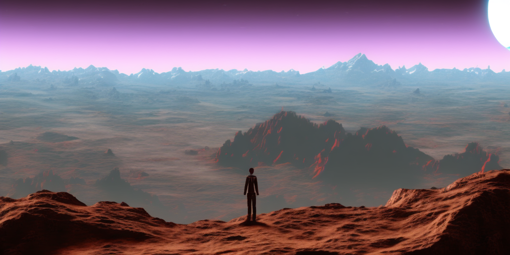

title: Loss Landscape
keywords: deep-learning,metaphors

# The Loss Landscape

**The metaphor** _You're standing at 54.5268° N, 3.0172° W, high on top of a hill, looking across rolling hills and towering mountains and wondering how to reach the bottom. At the same time, Adam starts at a random parameter allocation `[-0.024, 0.006, 0.022, ...]` and high loss value, with the job of finding parameters to minimise loss._

_You start walking downhill—and keep walking downhill until you reach the bottom, or get stuck in a lake. Adam looks at the current loss gradient and takes steps to reduce the loss accordingly, until it converges._

_Image generated by Stable Diffusion 2.1, prompt: "Person, standing on top, looking down rolling mountains on an alien planet, HQ, 4k"_

**The good** In this metaphor, we get a simple and intuitive way to think about the dynamics of training deep learning models. This is no small thing—inference in neural networks is complicated enough, so training dynamics often feel way out of reach. It also can provide an intuitive interpretation of momentum terms in optimisers, and perhaps also for variance terms (Adam).

The metaphor enjoys a tight correspondence: latitude-longitude - parameter values, altitude - loss value, slope direction - gradient, massive object descending under gravity - momentum, sharpness of terrain - Hessian. Many ideas from optimisation fit.

**The bad** One concern—there isn't necessarily one just loss landscape for a deep learning model. Do we mean the loss landscape defined by a single batch during training? In which case it changes at each step. Or that of the whole training dataset? In practice, then, we don't ever bother to really work out the gradient. Perhaps an infinite held-out validation dataset? So our gradients might be biased away from reality. (I would generally lump for the entire training dataset option, which gives a stable landscape with just some uncertainty about the gradient.)

More important, when we talk about a landscape, we think about our familiar (2+1)D. The fact that deep learning models inhabit a larger parameter space, e.g. ($10^9$+1)D is significant. High-dimensional spaces don't behave like low-dimensional ones. Almost all of the volume of a high-dimensional hypersphere is contained in a small eggshell around its surface. And space is very well-connected as it becomes hard to put up a wall between two points.

This all means that our intuition is misleading. We imagine an optimiser taking a long hike down a twisting valley between impassable mountains. But perhaps it's more like a short-ish distance through a dizzying number of comparatively simple dimensions. They might form groups with different natural scales and have lots of symmetries.

**Conclusion** It's hard to dismiss the loss landscape metaphor. In a way it isn't really a metaphor—there really is an `n_parameter`-dimensional manifold in an `(n_parameter+1)`-dimensional space that represents the optimisation objective. The problem is that our intuition for this is pretty rubbish. So we should think about this with caution, testing our assumptions and resisting the urge to over-generalise our low-dimensional experience.

As we step out into billions of nonphysical dimensions, we must acknowledge the loss of our spatial awareness. Even if it makes us dizzy.

---

- [Introduction](article.md)
- [A Neural Network](neural_network.md)
- **The Loss Landscape**
- [Attention](attention.md)
- [Mixture of Experts](mixture_of_experts.md)
- Finally, a [conclusion](conclusion.md), thanks for reading!
