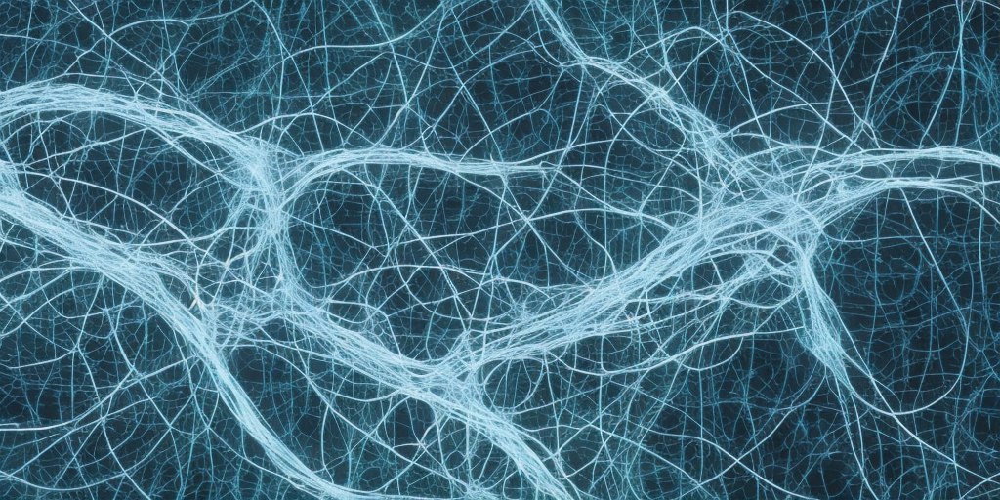

title: Neural Network
keywords: deep-learning,metaphors

# A Neural Network

**The metaphor** _The human brain is a 1kg lump of wetware, consisting 100 billion neurons and perhaps 100 trillion synapses. GPT-3, a large modern deep learning model, has approximately 10 million hidden units and 175 billion trainable parameters._

_The brain's neurons accept incoming signals on synapses continuously. Depending on the synapse, these signals either excite or inhibit the neuron. If enough excitatory inputs are collected in a short time, the neuron depolarises or "fires", giving it an output signal to pass on to further neurons. Many GPT-3 hidden units process inputs from other hidden units, multiplying each by a positive or negative weight and summing them up. The sum passes through a nonlinear "activation function", which produces the output to be passed to further hidden units._

_We can parallel the activation value of a GPT-3 hidden unit with the firing rate of a brain neuron. This averages out the timing sensitivity of the neuron, which makes things match up a bit better._

_Image generated by Stable Diffusion 2.1, prompt: "A biological neural network, with signals travelling along neurons"_

**The good** This metaphor is a classic! It inspired much early work in deep learning. It motivates nonlinearity, which plays a crucial but still slightly mysterious role in deep learning models. It motivates the exploration of sparsity and irregular network structures. It continues to drive us to explore extreme scale.

Biology has much to teach us crude, brute-force, engineers who assemble atoms and bits to dance to our tune. We should keep our eyes and ears open for these lessons. I hope the brain-deep learning metaphor will continue to inspire and fascinate machine learning researchers.

**The bad** The correspondence between brain and deep learning model is a very abstract and broad one. Modern deep learning techniques aren't trying to model the brain's mode of operation, and most current improvements haven't arisen from trying to improve the fidelity of the artificial neuron in behaving more like the biological one. Holding too closely to this metaphor may prevent us from exploring promising techniques that don't have a good biological interpretation and over-index on fruitless angles that do. Attention provides an example of the former, where the number of hidden units depends on the sequence length of the input—some gymnastics are needed to fit this into the metaphor.

At time of writing, the primary battleground here is around backpropagation and biological plausibility. Backpropagation in a biological system should entail keeping a memory of past firing around for a long time, while downstream neurons complete their forward and backward signal propagation, which seems implausible at the timescales of slow biological neurons. Biologically plausible learning mechanisms are an active area of research. In my mind, these techniques are independently interesting, but the loose nature of the neural network metaphor means I'm somewhat pessimistic about their application to mainstream deep learning.

**Conclusion** It is fun and interesting to think of a deep learning model as a neural network. However, we should start with a deep learning model as a composition of differentiable functions. The "magic powers" of these differentiable functions come from the chain rule, not from a rough approximation of biological neurons firing dynamics.

---

- [Introduction](article.md)
- **A Neural Network**
- [The Loss Landscape](loss_landscape.md)
- [Attention](attention.md)
- [Mixture of Experts](mixture_of_experts.md)
- Finally, a [conclusion](conclusion.md), thanks for reading!
