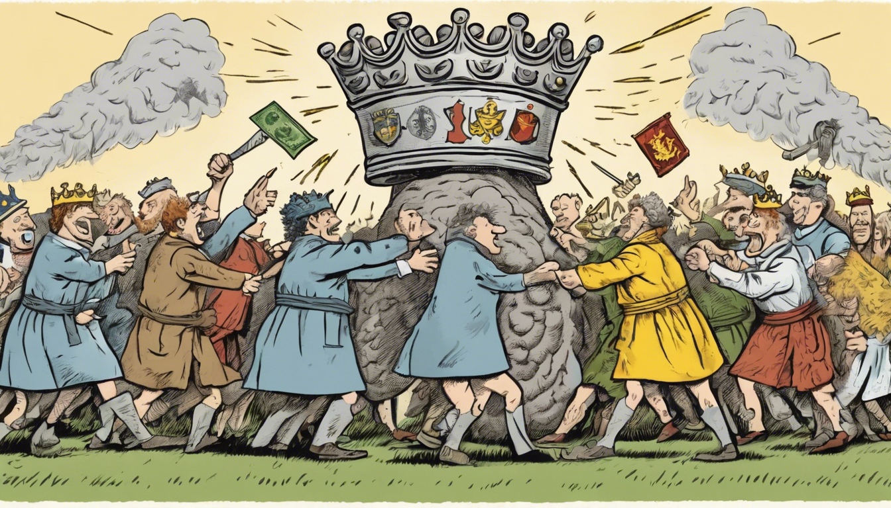

title: One {what} one vote
keywords: non-technical,economics

# One {what} one vote

While listening to Andrew Marr's excellent book "A History of the World", I was struck by the various ways we've organised society throughout history and the transitions between them.

For a while I've had in my mind the contrast "democracy means one person equals one vote, capitalism means one dollar equals one vote", today I had a go at extending this framework to some other systems.

**How are decisions that affect people in society made?**

- **Democracy**: one person one vote
- **Capitalism**: one dollar one vote
- **Autocracy**: one leader one vote
- **Communism**: one people one vote
- **Meritocracy**: one IQ-point one vote
- **Aristocracy**: one title one vote
- **Theocracy**: one god one vote
- **Feudalism**: one acre one vote
- **Oligarchy**: one clique few votes
- **Anarchy**: one action one vote
- **Bureaucracy**: one process no vote

Note that "one vote" means an atom of **decision-making power**; electoral voting may or may not be involved. The missing verb in most statements is "has" or "conveys", e.g. "one acre **conveys** one vote", with exceptions anarchy "one action **is** one vote" and bureaucracy.

Neither definition nor ordering are intended to imply a value judgement of any system.

---

<small>_Image generated by stable-diffusion-xl-1024-v1-0. Prompt: "Eight-way tug-of-war between a normal person, a dollar bill, a king's crown, lots of people, a brain, a coat of arms, a god-bolt of lightning, and a copse. Cartoon. Quirky."_</small>

## Reflections

**Ignorance** — My own, considerable. History, economics & politics are all a mystery to me. I'm sure this list is incomplete, inaccurate and inconsistent.

**Impostor** — Bureaucracy is an odd one out, as it doesn't specify where its hallowed processes come from. Perhaps it's a means for exerting decision-making power, being unable to hold it alone. Traditionalism could be treated similarly.

**Intermingling** — Practically, these never stand alone. The autocrat is often surrounded by an oligarchy of advisers and commanders, who (despite the autocrat's best efforts) wield some decision-making power of their very own. Capitalism can be embedded in a democracy that sets limits on the market. Sprinklings of anarchy and bureaucracy are there to oil or clog the wheels pretty-much everywhere.

**Indirection** — Even once we allow a mix of systems, we're still far from capturing the complexity of practical reality. For example: in a modern democracy, large media companies hold substantial power to influence how people think and vote. Inside these companies, there might be a cocktail of capitalist, autocratic, bureaucratic and anarchic influences on company decisions.

**Inevitability** — Are any of these systems stable? Under what conditions? I don't believe we know. Apparently environment, technology and history all make a huge difference & have shuffled societies between these systems countless times in human history, often painfully.

## Final thoughts

It'd be too bold to conclude anything from this reverie. But my parting thought is that I don't trust what system people say they're operating in. (Or what system I tell myself that I'm operating in.) Where have important decisions actually come from? It can be hard to tell, but if possible that's what would tell me which system is active.
