title: A transformer walk-through, with Gemma
keywords: deep-learning,llm,gemma
image: img/attention.png

# A transformer walk-through, with Gemma

Transformer-based LLMs seem mysterious, but they don't need to. In this post, we'll walk through a modern transformer LLM, Google's Gemma, providing bare-bones PyTorch code and some intuition for why each step is there. If you're a programmer and casual ML enthusiast, this is written for you.

**Our problem** is _single-step prediction_: take a string e.g. "I want to move", and use an already-trained language model (LM) to predict what could come next. This is the core component of chatbots, coding assistants, etc, since we can easily chain these predictions together to generate long strings.

We'll walk through this example using **Gemma 2B**, with an accompanying **notebook ([github](https://github.com/DouglasOrr/DouglasOrr.github.io/blob/examples/2024-04-transformers/gemma_walkthrough.ipynb), [Colab](https://colab.research.google.com/github/DouglasOrr/DouglasOrr.github.io/blob/examples/2024-04-transformers/gemma_walkthrough.ipynb))** which provides unadorned code for everything we'll see.

There are two ways to read this post: the main text describes the implementation, or what is required to run Gemma. The expandable sections add details about why the code does this, some of the machine learning model-building behind the code.

<details markdown="1"><summary>Understanding preliminaries (dot product)</summary>

To follow some of the optional "understanding" sections in this post, it's worth recapping the dot product between two vectors:

```python
def dot(a, b): return sum(a_i * b_i for a_i, b_i in zip(a, b))
```

It acts as a test of _agreement_. Here's an example of the dot product between some vectors in 2D:


From this we see that longer lines have larger magnitude dot products, and for a given length of vectors, the dot product will be largest (most positive) when they are in the same direction, zero when perpendicular, and smallest (most negative) when they are in the opposite direction.

Dot products between 2-vectors are quite easy to visualise. But Gemma involves dot products between 2048-, 256- and 16384-vectors, which are a bit more challenging! However, we can still think of these high-dimensional dot products as rating the agreement between two vectors.

</details>

## Tokenization

Tokenize the input string, splitting & mapping it to token IDs.

```python
tokenizer = transformers.AutoTokenizer.from_pretrained("google/gemma-2b")
input_ids = tokenizer("I want to move").input_ids
# input_ids = [2, 235285, 1938, 577, 3124]
```

The model works on sequences of _subword tokens_, represented as integers in the range [0, 256000), such as 1938 (=> "▁want"). Since the input comes in as a single long string, we use a tokenizer to first to split the string into tokens, second to map these tokens to numeric IDs.

<details markdown="1"><summary>Understanding tokenisation</summary>

Tokenisation is defined via a _vocabulary_, a large set of tokens that are understood by the model. These tokens might be whole words e.g. "The" or parts of words, e.g. " superlative" is split into ["▁super", "lative"].

```python
input_ids = tokenizer("The superlative").input_ids
print(tokenizer.convert_ids_to_tokens(input_ids))
# => ['<bos>', 'The', '▁super', 'lative']
```

This illustrates a few interesting things about the tokenizer.

- It is _subword_, able to split long words. (Since most characters are included, it can tokenize even gibberish "nvdkjsv" => ["n", "vd", "k", "js", "v"].)
- It doesn't throw whitespace away, mapping " " to "▁".
- It doesn't normalise capitalisation (651 => "The", 1175 => "the").
- It prepends a special "beginning of sequence" token, 2 => "<bos\>".
- The vocabulary is very large, `len(tokenizer.vocab)` is 256000.

All but the last point are standard for modern LLMs. We use subword tokenization since it gives great coverage of any input text. We include whitespace and don't normalise capitalisation to avoid all the cases where these rules have exceptions and ambiguities, passing these down to the model to figure out (e.g. when is the token "apple" the same thing as "Apple"?)

With subword tokenization, vocabulary size is a free choice of the model designer. Many modern models use vocabularies in the 30-60k range, while Gemma's is much larger at 256k. Large vocabularies can help coverage of the long tail of language, and there is a mild efficiency trade-off between larger vocabularies and shorter sequences versus smaller vocabularies and longer sequences.

Since this article aims at understanding the algorithm, I must apologise at this point. We're just going to treat subword tokenization as a black box. If you want to learn more, Gemma's tokenizer uses byte pair encoding (BPE), and at inference time the problem is a search through the vocabulary for a sequence of tokens that match the input string (there are generally multiple possible tokenizations of a given input).

</details>

## Embedding lookup

Convert token IDs to 2048-element vectors by looking them up in an _embedding_ table.

```python
hiddens = p.embedding[input_ids]
# p.embedding.shape = (256000, 2048)
# input_ids.shape = (5,)
# hiddens.shape = (5, 2048)
```

For each input token ID (e.g. 1938 => "▁want"), select the corresponding row from the large embedding table. The result, that we'll call `hiddens`, has shape (5, 2048), where there are 5 tokens along the sequence dimension, and 2048 components along the hidden dimension.

<details markdown="1"><summary>Understanding embedding</summary>

As we're about to see, most operations in Gemma are a dot product similarity between high-dimensional vectors. On one level, embedding lookup is just the simplest way to get from IDs to high-dimensional vectors. Note also that the numeric IDs associated with tokens are arbitrary (5000 => "画像", 5001 => "▁fish", 5002 => "mento"); an embedding table is desirable as it has no sense of locality or smoothness between consecutive IDs.

Since the model attempts to predict words based on similarity, we'd expect words that appear in the same contexts to have similar embeddings. In the figure below, we plot the cosine similarity between a few selected tokens from the vocabulary. Cosine similarity is the dot product with the length of input vectors normalised out, calculated as `dot(a, b) / sqrt(dot(a, a) * dot(b, b))`.

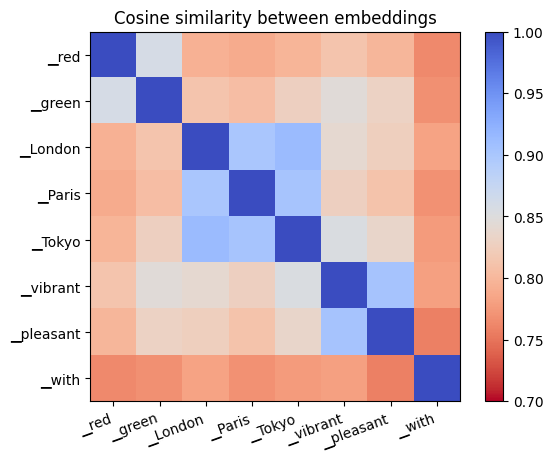

Words with similar function in language (colours, place names, adjectives) have similar embeddings. It'd be fun to read something into "Tokyo" and "London" being closer than "Paris" to "pleasant" and "vibrant", but that is perhaps a bit risky — this embedding similarity metric is a very blunt tool.

</details>

## Post-embedding rescaling

Scale up `hiddens` by `sqrt(2048)`.

```python
hiddens *= hiddens.shape[-1] ** 0.5
```

In Gemma, embedding parameters are shared between the input embedding lookup and the output embedding projection. This is a reasonable design, but some care is required to give appropriate scale to inputs and outputs. The scaling factor of `sqrt(hidden_size)` makes inputs larger without interfering with the output projection.

<details markdown="1"><summary>Understanding post-embedding rescaling</summary>

To see the need for a scaling factor, we have to skip ahead and consider the final output projection as well as the input embedding lookup. The final projection looks like:

```python
logits = hiddens @ p.embedding.T
```

So each element of `logits` comes from a dot product between `hiddens` and an embedding vector of length 2048. Typically, we initialise operations to preserve the _scale_ or standard deviation of their inputs. In this case, this means the scale of `embedding` should be `1/sqrt(2048)`.

```python
hiddens = torch.randn(10, 2048)
embedding_init = torch.randn(100, 2048) / 2048**0.5
logits = hiddens @ embedding_init.T
# hiddens.std() = 1.005
# logits.std() = 1.02
```

Returning to the input embedding lookup, this rule means that `hiddens` coming out of the embedding lookup also have scale `1/sqrt(2048)`. This isn't an immediate problem: as we shall see, the next operation that happens is a normalisation that resets the scale. The problem occurs when we add the contribution of the first attention layer to `hiddens`. At this point, a small incoming scale would mean that `hiddens` are in-effect replaced by the output of the first attention operation.

Post-embedding scaling therefore preserves the idea of a residual network, that the contributions of attention and MLP layers should be additive. After the first attention layer:

```python
# With scaling
hiddens = embeddings + attention(embeddings)
# Without scaling
hiddens ≈ attention(embeddings)
```

</details>

## Transformer layer

For each of Gemma's 18 transformer layers, add `attention(norm(hiddens))` then `mlp(norm(hiddens))` back into `hiddens`.

```python
for p_attn, p_mlp in p.layers:
    hiddens += attention(p_attn, rms_norm(p_attn.norm, hiddens))
    hiddens += mlp(p_mlp, rms_norm(p_mlp.norm, hiddens))
```

Here, Gemma uses the concept of _residual layers_, which build deep (many-layered) functions using the iteration `x = x + layer(norm(x))` rather than the simpler MLP iteration `x = layer(x)`.

<details markdown="1"><summary>Understanding residual layers</summary>

First, some background: when we talk of _representations_, these are the 2048-element vectors that pass through Gemma's operations. The idea of a residual layer is that every layer shouldn't create an entirely new type of representation, replacing the old one with `x = layer(x)`. It should instead just tweak the existing representation with an update `x = x + layer(norm(x))`.

If we call `x` the _skip_ connection, `layer(norm(x))` the _residual_ connection, and use standard deviation ($\sigma_s$, $\sigma_r$ respectively) to give an indication of the scale of the contribution of each, we can look at each layer's residual contribution when the skip and residual are added. Since uncorrelated variances would add, we use $\sqrt{\sigma_r^2 / (\sigma_r^2 + \sigma_s^2)}$ as a metric for the _update scale_ of the residual. If 0, the output is all from the skip connection, the layer doesn't contribute much at all; if 1, the output is all from the layer, the skip connection doesn't contribute much.

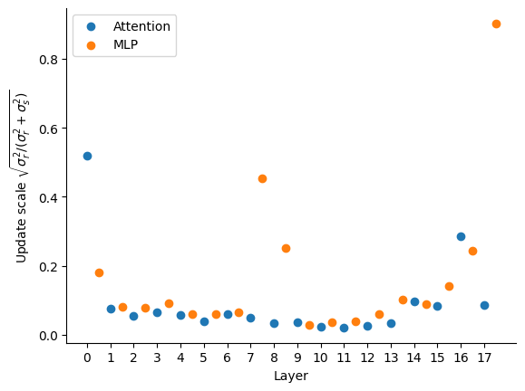

For our short example, this shows that most layers make a very small contribution, tweaking the existing representation rather than replacing it. A few layers make a larger contribution, notably the first attention layer and last MLP layer.

</details>

## RMSNorm

Divide out the root-mean-squared "RMS" from each token to reset it to 1. Then multiply each element by a learned scaling parameter.

```python
def rms_norm(x: Tensor) -> Tensor:
    # x.shape = (5, 2048)
    z = x.to(torch.float32, copy=True)
    z /= torch.sqrt((z ** 2).mean(-1, keepdim=True) + p.eps)
    z *= (1 + p.weight.float())
    # p.weight.shape = (2048,)
    return z.to(x.dtype)
    # return.shape = (5, 2048)

z = rms_norm(hiddens)
```

It's worth considering shapes and data types carefully. If the input shape `x.shape` is (5, 2048), then the normaliser `torch.sqrt(...)` has shape (5, 1). This is because we're doing a mean over the last axis, processing each token in the sequence independently. The division `z /= torch.sqrt(...)` performs _broadcasting_, dividing each element of a 2048-vector by the same value (different for each token).

Since some data types have limited range (e.g. 65e3 in float16 versus 3e48 in float32), it may not be safe to do `x ** 2` directly. If `abs(x) > 256`, this will overflow and cause an error. Therefore, we cast to `float32` at the beginning, and back to the original `x.dtype` at the end of the op. There is also a small epsilon value added to the denominator as `sqrt(... + p.eps)`, which helps protect against division by a very small number.

<details markdown="1"><summary>Understanding RMSNorm</summary>

To understand why Gemma has `rms_norm` at every layer, consider the update `hiddens = hiddens + layer(rms_norm(hiddens))`. The layers aren't linear, but they also don't saturate when inputs are large, so if we're just thinking about scale, we could imagine something like the following:

```python
# Without norm
hiddens = 1
for _ in range(18):
    hiddens += 2 * hiddens  # layer(x) = 2 * x
# hiddens = 387420489

# With norm
hiddens = 1
for _ in range(18):
    hiddens += 2  # layer(norm(x)) = 2
# hiddens = 37
```

Without a norm, the hidden representation will grow exponentially; with a norm, it grows only linearly. To test this in a more realistic setting, let's look at the scale (standard deviation) of the hidden representation before each attention and MLP layer in Gemma, both in the original model (with RMSNorm) and when all norms replaced by the identity function (without RMSNorm).

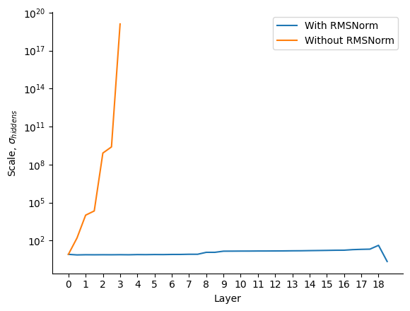

Note that removing the norm of an already-trained model wouldn't be allowed in any case, but this plot illustrates how normalisation helps to restrain the scale of the hidden representation across multiple layers. Exploding scale is undesirable: it can cause saturation of nonlinearities in the model, as well as numerical difficulties.

</details>

## Attention

The first type of residual layer in Gemma is _attention_. It combines representations across the sequence dimension.

```python
def self_attn(q: Tensor, k: Tensor, v: Tensor) -> Tensor:
    # t=target, s=source, n=kv-heads, m=q-heads-per-kv, d=head-dim
    a = torch.einsum("tnmd, snd -> nmts", q, k) / sqrt(q.shape[-1])
    a += torch.full(a.shape[-2:], -torch.inf, dtype=a.dtype).tril_(-1).T
    a = a.softmax(dim=-1)
    return torch.einsum("nmts, snd -> tnmd", a, v)

def attention(x: Tensor) -> Tensor:
    # x.shape = (5, 2048)

    q = (x @ p.q_proj.T).unflatten(-1, (1, 8, 256))
    k = (x @ p.k_proj.T).unflatten(-1, (1, 256))
    v = (x @ p.v_proj.T).unflatten(-1, (1, 256))
    # q.shape = (5, 1, 8, 256)
    # k.shape = (5, 1, 256)
    # v.shape = (5, 1, 256)

    o = self_attn(q, k, v)
    # o.shape = (5, 1, 8, 256)
    return o.flatten(1) @ p.o_proj.T
    # return.shape = (5, 2048)
```

The first step in attention is a projection (dot product with a parameter matrix) from the 2048-dimension input to 8 separate 256-dimension _query heads_, one 256-dimension _key_ and one 256-dimension _value_. This projection is done independently but in parallel for each token using the dot product operator `@`. Note that PyTorch typically keeps projections in transposed layout, so we need to transpose `q_proj` etc via `q_proj.T` before the dot product.

The 8 query heads are processed independently but in parallel by `self_attn`.

1. (Einsum does a dot product but allows dimensions to be reordered.) Einsum `tnmd, snd -> nmts` to take the first argument of shape `(target, kv-heads, q-heads-per-kv, head-dim)` and second of shape `(source, kv-heads, head-dim)` and run dot product over head-dim (256) to get a result of shape `(kv-heads, q-heads-per-kv, target, source)`. We can think of this as a `(target, source)` _attention matrix_ per query head.
1. Scale the attention matrix by `/sqrt(256)`.
1. Create a _causal mask_ using `torch.full(...)`, setting all source positions that are to the right of (i.e. after) target in the `(target, source)` matrix to `-infinity`. This prevents future tokens from influencing past ones.
1. Use `softmax(x)` to exponentiate `z = exp(x)` then normalise `z /= sum(z)` to get attention weights in the range [0, 1]. This is run independently for each target, normalising to sum to 1 over all sources. The causal-masked positions are now `exp(-infinity) == 0`.
1. Run a final einsum, `nmts, snd -> tnmd` to take the first argument of shape `(kv-heads, q-heads-per-kv, target, source)` and second of shape `(source, kv-heads, head-dim)` and run dot product over source (of size sequence length, i.e. 5), to get a result of shape `(target, kv-heads, q-heads-per-kv, head-dim)`. This is a weighted sum over the sequence, where the weights come from the `(target, source)` attention matrix.

Finally, the outputs of the heads are mixed together by flattening them from (5, 1, 8, 256) -> (5, 2048) then following a final output projection, `o_proj`.

<details markdown="1"><summary>Understanding Attention</summary>

Multi-query attention in Gemma can be thought of as 8 independent attention operations, which share some parameters (more on that later). The first step is projection by `q_proj`, `k_proj` and `v_proj`, which are trained model parameter matrices of shape `(2048, 256)`. This means picking 256 directions to test each 2048-vector in, then creating a 256-vector containing the result of each of these tests. From this, we get 5 _query_ vectors, 5 _key_ vectors and 5 _value_ vectors, all of 256 dimensions.

A high-level understanding of the next bit has an analogy to databases: there is a database of key->value mappings, and we want to retrieve them based on a query. Rather than just retrieving one (e.g. the closest match between query and key), however, we're going to get a weighted mixture of everything.

First, we use dot product to test for similarity between queries and keys (step 1 above). This matches queries against keys, producing a score for each (q, k) pair. We scale the result by `1/sqrt(256)`, which compensates for the sum inside the dot product over 256 entries.

The next step, causal masking, ensures that in the remaining steps, each token can only "see" itself and past tokens. This is essential for generative autoregressive models - if a token had to see future tokens before the next one is generated, you'd immediately get into a chicken-and-egg problem.

**Attention weights:** Next, softmax turns these scores into weights, which are in the range [0, 1] and always sum to 1 over all keys corresponding to a single query. The difference between the scores for two tokens going into a softmax becomes the ratio between the weights of those two tokens after the softmax. For example, if you have softmax over two tokens X and Y, with score 0 and -0.693 respectively, you'd know that Y must have 1/2 the weight of X, so the softmax would output 2/3 for X and 1/3 for Y.

These weights are quite fun to visualise, so I expect you've seen them before. Here they are for our example, for every head (8 per layer) in every layer (18):

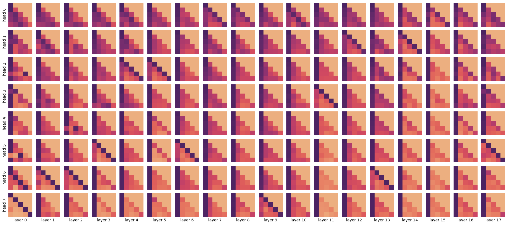

Each square represents an attention weight matrix after the softmax. Dark pixels are high weight, light pixels are low weight. The x-axis is the source position, corresponding to the key. The y-axis is the target position, corresponding to the query. The lower-diagonal pattern shows the causal mask — a source must have zero weight for all targets to the right of it. The leading diagonal is the score for the token's own key. The ordering of layers is not arbitrary, as layers are executed in sequence. Attention head ordering is arbitrary, since heads are executed in parallel. We have therefore reordered the heads in the plot above; the "flatter" heads are at the top, and "spikier" heads are at the bottom.

Even from such a simple sequence of just 5 tokens, we can see some patterns. Some heads are flat, taking a broad average. Many look at the first token. Some consistently look one token to the left. But the general point is that these attention weight matrices illustrate the power of attention. The model contains a large number of attention heads, each of which can move information between tokens flexibly, depending on position and/or content.

**Mixing:** These weights are then used to perform a weighted sum of the value vectors that were generated earlier. This also just a dot product, this time over the sequence axis (5 tokens). The attention weights we looked at are important because they determine how much of the output comes from each source token in this step.

At this point, there are 8 sequence-mixed outputs of shape `(5, 256)`, one for each head. The final step is to mix across heads. This involves projecting up with the output projection `o_proj` so that each head produces a 2048-vector, then adding up the results over all heads. (When the heads are computed in parallel, this is equivalent to reshaping and then projecting, as per the code.)

**Grouped-query attention:** Gemma includes a modification to the above scheme which is called _grouped-query attention_, where each head is not fully independent, but shares the key and value projection across 8 query heads. In Gemma 2B, this is all the query heads. This is why `k_proj` and `v_proj` are of shape `(2048, 256)` while `q_proj` is of shape `(2048, 8*256)`. This turns out to be very useful for the efficiency of token-by-token generation, which has to re-download keys and values at each generation step. But grouped-query attention doesn't change the picture much as we seek to understand attention.

**Dimensions:** There are a few design choices in attention:

- Head dimension (256) - typically set in the range [64, 256]. The idea is to have enough space to express interesting interactions, while leaving space for enough query heads given a fixed compute budget.
- Number of query heads (8) - typically set so that the product of number of query heads and head dimension is equal to the hidden dimension (2048). Each head has its own attention weight matrix over the context, so increasing this number gives more flexibility to the model, at the cost of being more expensive to compute.
- Number of query heads per key-value head (8) - a trade-off between the model performance (best with a key-value head per query head) and efficiency at inference time (best with all query heads sharing a single key-value head).
- Value head dimension (256) - in principle, this is independent from the query-key head dimension, but it's usually set to the same value.

</details>

## Rotary positional encoding (RoPE)

When we described attention, we omitted one line from the definition, so we could talk about it now. After projecting to get `q` and `k`, Gemma replaces them using rotary positional encoding, which allows attention to vary depending on relative position.

```python
def rotate(z: Tensor, cos: Tensor, sin: Tensor) -> Tensor:
    zx, zy = z.unflatten(-1, (2, -1)).movedim(-2, 0)
    return torch.cat([zx * cos - zy * sin, zy * cos + zx * sin], -1)

def embed_rotate(q: Tensor, k: Tensor, theta: float) -> Tensor:
    # q.shape = (5, 1, 8, 256)
    # k.shape = (5, 1, 256)
    d = q.shape[-1]
    freq = theta ** -(torch.arange(0, d, 2, dtype=torch.float) / d)
    angle = torch.arange(q.shape[0])[:, None] * freq
    cos = angle.cos().to(q.dtype)
    sin = angle.sin().to(q.dtype)
    return (
        rotate(q, cos[:, None, None, :], sin[:, None, None, :]),
        rotate(k, cos[:, None, :], sin[:, None, :]),
    )

# In attention()
q, k = embed_rotate(q, k, theta=p.rope_theta)
```

Rotary positional encoding transforms `q` and `k`, keeping them the same shape. It does exactly the same thing for every attention head, so we can think of it as mapping from `(5, 256) -> (5, 256)`. It transforms these in pairs, treating the 256-vector as 128 $\times$ 2-vectors.

1. Generate an array of 128 different angular frequencies from 1 to `1/theta = 1/10000`.
1. For each frequency and position in the sequence, calculate the phase angle `freq * position`. This is the angle (in radians) that we will rotate the corresponding 2-vector by.
1. Compute `cos` and `sin` of that angle for the rotation.
1. Rotate each head within `q` and `k` independently. Use the first 128 components of each head as x-coordinates, and the second 128 components as y-coordinates to give the 2-vectors to be rotated. Then use trigonometry `x' = x cos a - y sin a`, `y' = y cos a + x sin a` to calculate the rotation.
1. Concatenate `x'` and `y'` back into their original position in `q` or `k`.

Inserting this transformation between the calculation of `q,k` and the `self_attn` function that uses them to compute attention is sufficient to give Gemma the ability to deliberately attend to tokens based on position, not just content.

<details markdown="1"><summary>Understanding rotary positional encoding</summary>

Let's start with an example. Imagine we have the same `q` and `k` vectors in each position, `(x, y) = (1, 0)`. Then, after rotary encoding with two different frequencies (the highest with frequency 1, and component 20/128 with frequency 0.24), we get this:

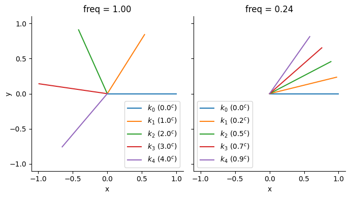

The important property to note here is the _rotational invariance_ of dot product. Since the pre-rotation vectors were the same, the dot product $k_0 \cdot k_1$ is the same as $k_1 \cdot k_2$, and $k_2 \cdot k_3$, etc. (Similarly, $k_0 \cdot k_2 = k_1 \cdot k_3$, etc.) So, the dot product between RoPE-encoded vectors doesn't depend on the absolute position of the tokens `[0, 1, 2, 3, 4]`, but only on the relative offset between them and the original vector before it was rotated.

Since the dot product (einsum) between the 256-vectors `q` and `k` is identical to the sum over all 128 $\times$ 2-vectors, the rotational invariance property of each 2-vector is carried over into the attention matrix, which means that the attention weights can only depend on the original projected `q`, `k` and on the relative offset in their positions.

**Different frequencies:** Note that rotary encoding doesn't just use a single frequency for all of the 128 $\times$ 2-vectors. This is critical. With dot product, it's impossible to tell whether a vector has been rotated by `a` or `2*pi - a` or `2*pi + a` or `4*pi - a`, etc. But even though a single component might be ambiguous, if enough different frequencies are used it's possible for every position to be distinguished.

We may also wish to allow some heads where position matters greatly, requiring high frequency rotations, and some other heads where position doesn't matter at all and the head just looks for certain tokens, wherever they appear in the sequence, requiring low frequency rotations.

It's intuitive to look at the _wavelength_ of rotations, calculated as `2*pi/freq`. This is equivalent to the position offset before the rotation starts repeating itself. Here are the wavelengths of Gemma's components:

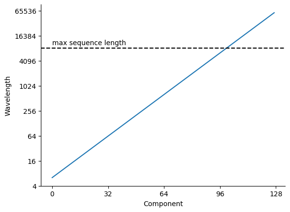

We see from this that Gemma's highest frequency component has a wavelength of about 6, and the lowest has about 60000. This allows the shortest wavelengths to distinguish between individual tokens, while the longest wavelengths can ignore position entirely within the maximum sequence length of 8192.

We can look at how long each q-vector is for every query head and rotary component, over our example text:


Since this is averaged over just 5 tokens of sequence length, it is quite noisy — don't read too much into this, but we can see that heads vary in terms of which query components they use. Some position-agnostic heads use longer wavelength components, while position-sensitive heads use shorter wavelength components. The strong stripe near to the maximum sequence length (8192) is interesting. I'm afraid I can't offer much as to why that sits there.

</details>

## Multi-layer perceptron (MLP, GeGLU)

The second type of residual layer in Gemma is the _multi-layer perceptron_ (MLP), specifically the Gaussian error gated linear unit (GeGLU). This is a bit simpler than attention:

```python
def mlp(x: Tensor) -> Tensor:
    # x.shape = (5, 2048)
    gate = x @ p.gate_proj.T
    up = x @ p.up_proj.T
    z = nn.functional.gelu(gate) * up
    # {gate, up, z}.shape = (5, 16384)
    return z @ p.down_proj.T
    # return.shape = (5, 2048)
```

The MLP takes input representations for each token as a 2048-vector, then applies the same transformation to each of the tokens independently.

First, make two separate projections (dot products with trained parameter matrices) to get two 16384-vectors. One of these vectors, called the _gate_ is passed through a nonlinear function called _gelu_ that applies to each element. We'll treat the function as a black box, but to a first approximation, `gelu(x)` is quite close to `max(0, x)`. The gate and other vector are multiplied element-by-element, then another trained down-projection produces the result, a 2048-vector.

<details markdown="1"><summary>Understanding the MLP</summary>

The MLP is a function from a 2048-vector representing a single token to a 2048-vector. The code shown above runs in parallel over the sequence axis, but unlike in attention, each token is processed independently. In this section, we'll build up the complex behaviour of Gemma's GeGLU MLP with a tiny example based on 2-vectors (and a 3-vector inside the MLP).

_Note that the acronym MLP stands for multi-layer perceptron, which is slightly old-fashioned language to talk about a chain of dot product (projections) and nonlinearities._

**A. Linear**

We start with a simple linear projection (dot product) from input to output, specified by a random $2 \times 2$ matrix. Each output component is a weighted sum of the inputs. The code is simply:

```python
y = x @ proj
# x.shape = y.shape = (2,)
```

If we look at the first component of the output as a function of the inputs, we see:

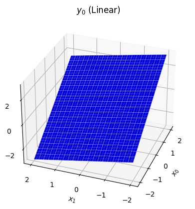

This is what a linear projection always looks like — a flat slope. It's certainly possible for this function to capture some interesting properties of the data, especially when it works on 2048-vectors rather than 2-vectors. However, it will become much more powerful with a few additions.

**B. ReLU**

The core idea of the MLP is that we wish to introduce _depth_ into the model, a sequence of layers that transform the input in steps. However, the dot product has the property that a sequence of dot products can be reduced to a single dot product, i.e. there exists a `proj_b` such that `(x @ proj_1) @ proj_2 == x @ proj_b`.

Sequences of dot products need to be broken up if they're going to be any more powerful than the simple linear projection we've already seen. The simplest way to do this is by transforming each element of the vector individually by an elementwise nonlinear function. One such function is the _rectified linear unit_ or ReLU, `relu(a) = max(0, a)`:

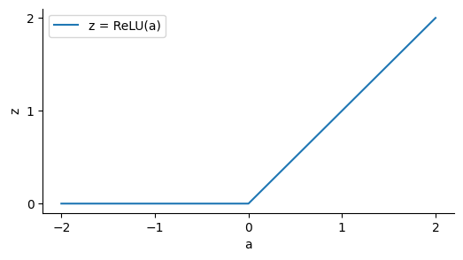

Our ReLU MLP now runs:

```python
z = relu(x @ gate_proj)
y = z @ down_proj
# x.shape = y.shape = (2,)
# z.shape = (3,)
```

Since ReLU has two distinct regimes with `z == 0` and `z > 0`, we are interested in which half we're in. If we take each component of `z` and give `z > 0` a different colour (red, green, blue), we can get a map that shows which combination of `z[i] > 0` for each input point `x`:

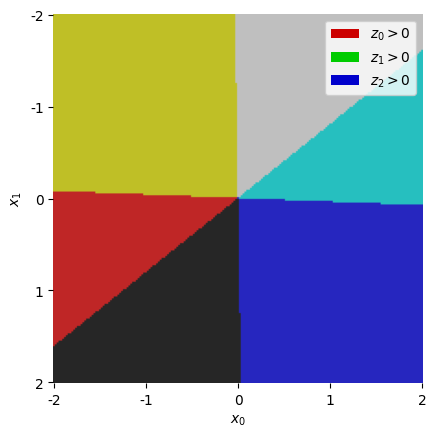

In the top right off-white segment, we have all three components of `z` "active" (not saturating at zero), so in this region we have `z = x @ gate_proj` (the ReLU disappears). In the yellow region on the left, we know the blue component `z[2]` is saturating, so in this region we have `z = (x @ gate_proj) * [1, 1, 0]`, effectively removing that component. Within each coloured region, `z` is a linear function of `x`.

Once we run the down-projection, each component of `y` is a dot product between `z` and a vector of trained weights, so the result remains piecewise-linear, transitioning at the boundaries we've just seen:

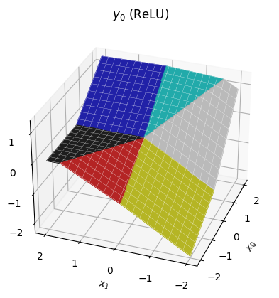

**C. ReGLU**

These piecewise linear functions are surprisingly powerful already — the pretraining procedure can manipulate the transitions as well as the slopes of each region. But we might propose more power by making each region quadratic rather than linear. This idea gives us the _gated linear unit_ (GLU):

```python
z = relu(x @ gate_proj) * (x @ up_proj)
y = z @ down_proj
```

With the same `gate_proj`, the regions in this version are exactly the same as before; the only difference is that within each region, we have a quadratic function of `x`.

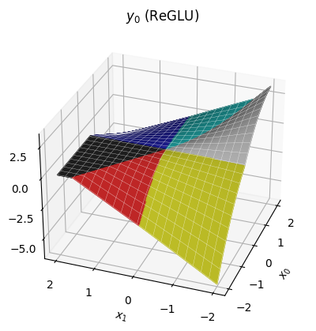

Notice we can still have sharp edges at the region boundaries, but within each region the function is now curved.

**D. GeGLU**

The final change is to substitute the Gaussian error linear unit (GELU) for the ReLU. The definition isn't too important for our discussion, just that it looks like a smoother version of ReLU:

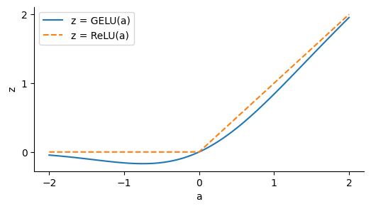

The idea of GELU is that it will allow us to build smoother functions than ReLU. I think this is done primarily for the sake of optimisation during training, but it might be that this gives better shapes of function for inference too.

Plugging this into the gated linear unit, we have the full form of an GeGLU MLP as per the original code. It looks quite similar to the ReGLU, but you should be able to see that the transitions between regions are considerably smoother.

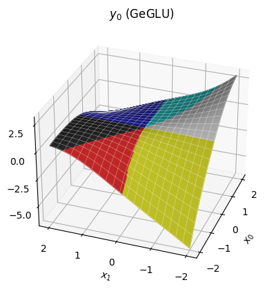

Our approach of considering distinct regions is broken down by the GELU, which doesn't saturate at exactly zero, so does not create strict regions where components of `z` can be discarded. However, since the GELU is quite similar to ReLU, it's still somewhat reasonable to think in terms of piecewise quadratic regions, at least at a coarse enough scale.

**Summary**

A final figure might help review the journey we've been on, from Linear -> ReLU -> ReGLU -> GeGLU. To make things legible, we're now looking at a slice through the surfaces we've seen so far, setting `x[1]` to a constant value, and just looking at how `y[0]` depends on `x[0]`.

![Four line plots, shown as x[0] varies from -2 to 2. The first, linear is linear. The second, ReLU, is piecewise linear. The third, ReGLU, is piecewise quadratic with gradient discontinuities. The fourth, GeGLU, is smooth but still vaguely quadratic.](img/mlp_slice.png)

So Gemma's MLP, the GeGLU, can be thought of as a piecewise-quadratic function with smooth boundaries between the pieces. Where our example had 6 regions across a 2-vector input, Gemma's MLPs may have a vast number of regions (perhaps $10^{2000}$) across their 2048-vector input.

The purpose of the MLP in Gemma is to use this function to independently transform each token, ready to form another attention query or ready to match against output tokens. Although MLPs cannot fuse information from across the context by themselves (which is the fundamental task of a language model), our experience shows that including the MLP makes attention much more efficient at doing exactly this.

</details>

## Final norm

Before we predict the output tokens, we run RMSNorm one final time on the token representations:

```python
hiddens = rms_norm(p.final_norm, hiddens)
```

<details markdown="1"><summary>Understanding the final norm</summary>

We include a final norm because, even though the RMSNorm on the residual branches has stopped the hidden scale from exploding exponentially, it still may have grown considerably. High RMS values going into the output projection would cause very spiky (over-confident) softmax outputs, so a final norm allows the model to use large scale within the body of the transformer without propagating them to become over-confident outputs.

For our example:

|               Token: | <bos\> |  I   | ▁want | ▁to  | ▁move |
| -------------------: | :----: | :--: | :---: | :--: | :---: |
| Before RMSNorm, RMS: |  88.5  | 16.3 | 14.4  | 12.9 | 12.6  |
|  After RMSNorm, RMS: |  2.2   | 2.2  |  2.2  | 2.2  |  2.2  |

</details>

## Output projection

Finally, project the representation 2048-vector up to a 256000-vector, independently but in parallel for each token in the sequence, producing a score for every possible next-token prediction.

```python
logits = hiddens @ p.embedding.T
# hiddens.shape = (5, 2048)
# logits.shape = (5, 256000)
```

This operation shares the same parameters `embedding` used in embedding lookup step earlier. This is just as well, as it consumes a chunky 0.5B parameters of the 2B parameter model.

<details markdown="1"><summary>Understanding the output projection</summary>

There's not much to add beyond our earlier discussion _"understanding embedding lookup"_. In the same way as embedding lookup, the 2048-vector space gives enough freedom to predict 256000 tokens, since it can exploit commonalities between words, placing similar words together in embedding space.

The output of this hidden-embedding product is a score for each token in the vocabulary. We can turn this score into a probability using `probability = softmax(score)`, where `y = softmax(x)` means `z = exp(x)`, `y = z / z.sum()`. For our example, this gives the following top 10 results after each token:

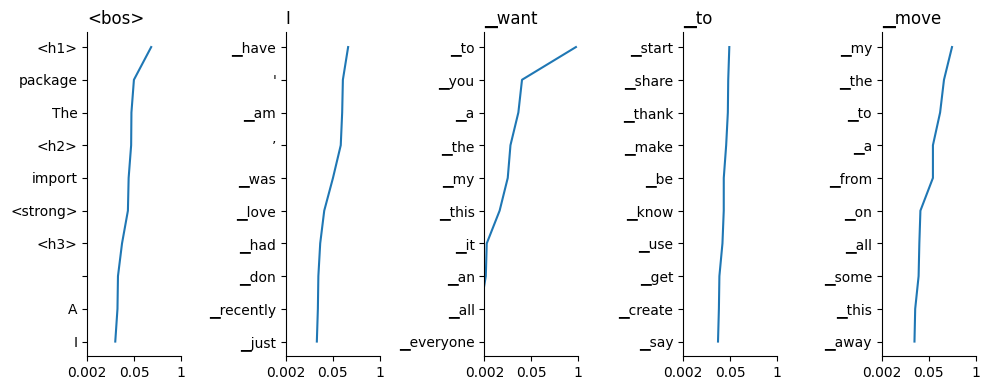

To follow the predictions in context, read the titles from left to right to a given column, then scan down the plot for a list of possible next words. We see that in some cases the model is very confident, for example after "I want", Gemma is quite confident the next token is "to". Sometimes the output is flatter: after "I want to", Gemma thinks there's a wide range of likely predictions.

At this point, it's up to the application to do what it wants with these predictions, so our journey is at an end. Gemma thinks that "I want to move" predicts " my".

</details>

## That's it!

Congratulations, you've done it — you've made it to the end of Gemma. I hope it has been a fun ride (I have certainly enjoyed it!) There's not much of a conclusion, but if forced, I'd offer:

1. Much of the transformer's operation comes down to the humble dot product.
1. As algorithms go, the transformer isn't all that complex.

That said, this was just a taster; here are a few out-of-scope topics I think are very interesting, in no particular order:

- Training / fine-tuning.
- Efficient implementation (especially parallel and distributed).
- Low-precision computation (training and inference).
- Integration into a full inference system, with batching, masking & search.
- Evaluation methods.
- Sparse computation.
- Alternative architectures (e.g. RNN, S4).
- Application to other domains.
- Practical applications & alignment.

There's plenty to learn, then. I hope that we can make some progress together!
