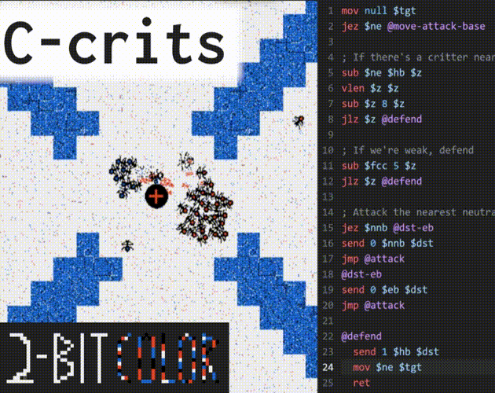

title: Procedural Textures with Hash Functions
keywords: graphics,maths,hash-functions
image: img/preview.png
description: A visual exploration of a family of 2D hash functions for procedural texturing, where a simple quadratic equation produces amazing variety as the parameters are varied.

<script src="./hash_textures.js"></script>
<link rel="stylesheet" href="./hash_textures.css">
<style>
.hv-equation {
  font-size: small;
}
.hv {
  max-width: 25em;
  margin-top: -0.5em;
  margin-bottom: 1.2em;
  padding-bottom: 0.8em;
}
.hv-large {
  max-width: 100%;
}
.favourites {
    display: inline-block;
    width: 100%;
}
.favourites > div {
    display: inline-block;
}
.favourites .hv {
    width: 20em;
}
.favourites .hv-equation {
  font-size: 0.65em;
}
</style>

# Procedural Textures with Hash Functions

and <a class="hv-title" href="./hv.html">Hash Playground</a>

I'm the sort of person who gets very excited when simple rules create complex behaviour. The other day, I needed a simple hash function that maps $(x, y)$ coordinates to a colour, and found a straightforward equation that ended up being astoundingly rich. Hence this post; to talk about and play with this function.

**TL;DR: The boolean predicate $(c_x \, x + c_y \, y + c_{xy} \, x \, y + c_{x^2} \, x^2 + c_{y^2} \, y^2)$ $\mathrm{mod} \, m < \tau \, m$, is richly varied and beautiful.**

For example, varying $c_{xy}$ with the other parameters fixed:

<div class="hv hv-show-equation hv-large"
  data-hv-init="x1 y1 xy* xx1 yy1 p64 t0.5 h256w256 k000000 j0ed3e1 r0.5"
></div>

For the rest of this post, we'll try to unpick the function. If you'd prefer to play with it yourself, check out the [hash playground](hv.html).

## The idea

I was trying to make a game that obeyed a 2-bit colour palette. With a strict interpretation of the rules, this means no interpolation or antialiasing — the pixels onscreen should only be one of 4 colours. So I needed textures that could align perfectly to the screen. The not-at-all novel solution:

_Hash the (x, y) screen-space pixel coordinate, and use it to choose a colour._

It turns out that this works fine, as long as the camera and viewports are fixed, and this very simple hash function is remarkably varied and interesting:

$$(c_x \, x + c_y \, y + c_{xy} \, x \, y + c_{x^2} \, x^2 + c_{y^2} \, y^2) \,\mathrm{mod} \, m < \tau \, m$$

In Python, for example:

```python
c_x, c_y, c_xy, c_xx, c_yy = 1, 1, 0, 1, 1
m, t, w, h = 64, 0.5, 128, 128

x = np.arange(w)[:, None]
y = np.arange(h)[None, :]

h = (c_x*x + c_y*y + c_xy*x*y + c_xx*x**2 + c_yy*y**2) % m < t*m

display(PIL.Image.fromarray(h))
```

## A little understanding

Let's try to build up the maths to understand some of the structure behind these patterns. We'll call the expression between $()$ the body. Note that everything in this section uses a canvas width of $128$, divisor $m\\!=\\!64$ and threshold $\tau\\!=\\!0.5$.

**What if our body is just $(x)$?** The hash won't depend on $y$ and should be $\mathrm{true}$ for $x \\!<\\! 32$ and $\mathrm{false}$ for $32 \\!\leq\\! x \\!<\\! 64$. It should repeat twice over our canvas width of $128$:

<div class="hv hv-show-equation"
  data-hv-init="x1 y0 xy0 xx0 yy0 p64 t0.5 h8w128 k000000 j0ed3e1"
></div>

**How about $(x^2)$?** I expected to see a twice-repeating pattern again, but I was wrong — we get $4$ copies:

<div class="hv hv-show-equation"
  data-hv-init="x0 y0 xy0 xx1 yy0 p64 t0.5 h8w128 k000000 j0ed3e1"
></div>

I.e. the pattern seems to repeat after $m/2$ not $m$. Let's see what happens if we add $m/2$ to $x$:

$$
\begin{align}
&(x + m/2)^2 \\,\mathrm{mod}\\, m  \\\\
&= (x^2 + m\,x + m^2/4) \\,\mathrm{mod}\\, m \\\\
&= x^2 \\,\mathrm{mod}\\, m \\;\\;(\textrm{if } m \textrm{ is a multiple of } 4) \\\\
\end{align}
$$

Since the $+\, m/2$ disappears, the pattern must repeat every $m/2$ pixels rather than $m$.

To understand the pattern itself, it's like an extreme aliasing effect. Scanning left to right, first you follow a quadratic: black then blue. Then you skip over the $m$ boundary, and you have the same thing again but faster. And again even faster. Eventually, you're skipping so fast that after every other pixel you're skipping to the next multiple of $m$. Like watching a video of helicopter blades as they spin up, the pattern starts to run backwards. The frequency slows again until the next long black patch when you're skipping $\approx m$ every pixel. Then the pattern repeats.

**Going 2D, $(x^2 + y^2)$.** To get genuinely interesting patterns, we need to use $x$ and $y$. Since the equation of a circle is $x^2 + y^2 = \textit{const}$, circles are _iso-hash_ lines which are clearly visible. Since the expression is built using $x^2$ and $y^2$, we get $2$ copies per $m$ in each axis, so $(2 \cdot 128/64)^2 = 16$ sets of circles in total.

<div class="hv hv-show-equation"
  data-hv-init="x0 y0 xy0 xx1 yy1 p64 t0.5 h128w128 k000000 j0ed3e1"
></div>

**Increasing the frequency, $(2 x^2 + 2 y^2)$.** Unsurprisingly, doubling $c_{x^2}$ and $c_{y^2}$ doubles the frequency of the pattern, equivalent to halving $m$ from $64$ to $32$.

<div class="hv hv-show-equation"
  data-hv-init="x0 y0 xy0 xx2 yy2 p64 t0.5 h128w128 k000000 j0ed3e1"
></div>

**Cross terms, $(x\,y)$.** Some of my favourite patterns come from fiddling with $c_{xy}$. Even the simple body $x\,y$ is interesting. I don't have much of an explanation, except that the iso-hash is $x\,y = \textit{const}$, producing a family of reciprocal curves $y\propto1/x$, which seems to match the black and blue lines that form a pleasing spiral.

<div class="hv hv-show-equation"
  data-hv-init="x0 y0 xy1 xx0 yy0 p64 t0.5 h128w128 k000000 j0ed3e1"
></div>

That's all I've got for understanding; I'm sure there's much more that could be said from the maths of modular arithmetic, which is mostly beyond me.

## Some favourites

Here are some personal favourites after some idle tinkering. Note the similarity in the first two equations, which produce very different patterns.

<div class="favourites">
<div><div class="hv hv-show-equation"
data-hv-init="x3 y3 xy32 xx6 yy6 p32 t0.5 h128w128 kffffff jff0000"
></div></div>
<div><div class="hv hv-show-equation"
data-hv-init="x3 y3 xy32 xx7 yy7 p32 t0.5 h128w128 kffffff j007529"
></div></div>

<div><div class="hv hv-show-equation"
data-hv-init="x0 y0 xy3 xx1 yy1 p32 t0.5 h128w128 ke8f359 jff1a3c"
></div></div>
<div><div class="hv hv-show-equation"
data-hv-init="x3 y3 xy17 xx2 yy2 p64 t0.8 h128w128 kffffff jff751a"
></div></div>
</div>

It's particularly fun to sweep the threshold $\tau$, which can be useful for effects like explosions.

<div class="hv hv-show-equation hv-large"
  data-hv-init="x0 y0 xy31 xx7 yy7 p64 t* h192w192 kffffff j000000 r10"
></div>

## Wrap up

I hope you enjoyed staring at the complexities of a simple function for a few minutes! If you haven't already, try the [hash playground](hv.html). Maybe you can generate a new texture for your game or print a case for a mobile phone (my next step).

See if you can spot some of these hash textures in the clip from my game-jam game below. And if you consider yourself part of the extremely limited target audience (who want to learn an assembly-like language just to play a short web game), perhaps check it out: [C-crits](https://douglasorr.itch.io/c-crits).

Happy Hashing!

---

<a href="https://douglasorr.itch.io/c-crits" target="_blank">

</a>
